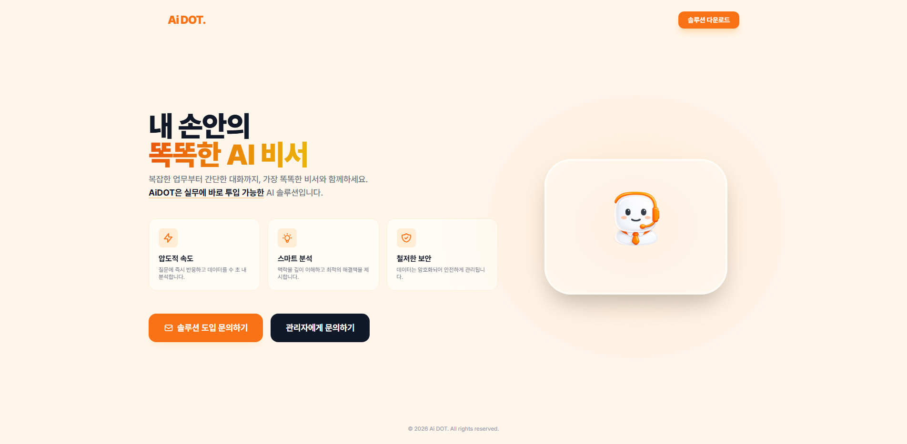
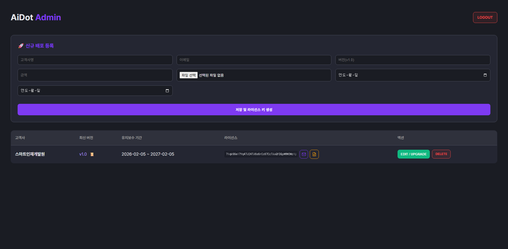

# Ai DOT - 시연 발표 자료

## 문서 정보

| 항목 | 내용 |
|------|------|
| 프로젝트명 | Ai DOT (AI 기반 업무 협업 플랫폼) |
| 발표 주제 | 프로젝트 시연 발표 |
| 작성일 | 2026-02-07 |

---

## 1. 프로젝트 소개

### 1.1 프로젝트 개요

**Ai DOT (Document Operations & Teamwork)** 는 AI 기반 통합 업무 협업 플랫폼입니다.

기업 내 업무 효율성을 향상시키기 위해 문서 관리, AI 챗봇, 이미지 생성, 회의록 분석, 일정 관리 등 다양한 기능을 하나의 플랫폼에서 제공합니다.

### 1.2 프로젝트 배경 및 목표

| 항목 | 내용 |
|------|------|
| **문제 인식** | 기업 환경에서 문서, 회의, 일정 등 업무 도구가 분산되어 있어 생산성 저하 |
| **해결 방안** | AI 기술을 활용한 통합 업무 플랫폼 구축 |
| **핵심 목표** | 폐쇄망 환경에서도 동작하는 온프레미스 AI 서비스 제공 |

### 1.3 주요 특징

- **로컬 AI**: 외부 API 없이 로컬 GPU에서 LLM, 이미지 생성, STT 모두 처리
- **분산 아키텍처**: Master-Worker 구조로 GPU 자원을 효율적으로 분배
- **폐쇄망 지원**: 인터넷 연결 없이 완전히 독립적으로 운영 가능
- **RAG 시스템**: 업로드한 문서를 기반으로 지능적인 AI 응답 생성

---

## 2. 기술 스택

### 2.1 전체 기술 구성

```
┌─────────────────────────────────────────────────────────────┐
│                      Frontend                                │
│   React 19  |  Vite 7  |  TailwindCSS 4  |  Recharts       │
├─────────────────────────────────────────────────────────────┤
│                      Backend                                 │
│   FastAPI  |  SQLAlchemy 2.0  |  Celery  |  Redis           │
├─────────────────────────────────────────────────────────────┤
│                      AI / ML                                 │
│   LLaMA 3 Bllossom 8B  |  SD 3.5 Medium  |  Whisper STT    │
│   LangChain + ChromaDB (RAG)  |  ko-sbert-nli (Embedding)   │
├─────────────────────────────────────────────────────────────┤
│                    Infrastructure                            │
│   Docker  |  MySQL 8.0  |  Redis  |  NVIDIA CUDA 12.1      │
└─────────────────────────────────────────────────────────────┘
```

### 2.2 상세 기술 스택

| 구분 | 기술 | 설명 |
|------|------|------|
| **Frontend** | React 19 + Vite 7 | 컴포넌트 기반 SPA |
| **스타일링** | TailwindCSS 4 | 유틸리티 기반 CSS |
| **차트** | Recharts | 대시보드 데이터 시각화 |
| **Backend** | FastAPI 0.109 | 비동기 REST API |
| **ORM** | SQLAlchemy 2.0 | 데이터베이스 추상화 |
| **DB** | MySQL 8.0 | 관계형 데이터 저장 |
| **캐시** | Redis | 세션 캐시 + 메시지 브로커 |
| **벡터DB** | ChromaDB | RAG용 벡터 데이터베이스 |
| **비동기** | Celery | 분산 태스크 큐 (백그라운드 AI 처리) |
| **LLM** | LLaMA 3 Korean Bllossom 8B | 한국어 특화 로컬 LLM (GGUF) |
| **이미지** | Stable Diffusion 3.5 Medium | 이미지 생성 (ComfyUI + GGUF) |
| **STT** | Faster Whisper Large-v3 | 음성-텍스트 변환 (INT8) |
| **임베딩** | ko-sbert-nli | 한국어 문서 임베딩 (한국어 NLI 학습) |
| **인프라** | Docker + Docker Compose | 컨테이너 기반 배포 |
| **GPU** | NVIDIA CUDA 12.1 | GPU 가속 처리 |

---

## 3. 시스템 아키텍처

### 3.1 분산 아키텍처 개요

```
                         ┌──────────────┐
                         │   Client     │
                         │  (Browser)   │
                         └──────┬───────┘
                                │ HTTP / WebSocket
                                ▼
┌──────────────────────────────────────────────────────────────┐
│                  PC1 - Master Server (192.168.0.9)            │
│                                                               │
│  ┌──────────┐  ┌──────────┐  ┌────────┐  ┌───────────────┐  │
│  │ Frontend │  │ Backend  │  │ MySQL  │  │    Redis      │  │
│  │  :5173   │  │  :8000   │  │ :3306  │  │    :6379      │  │
│  └──────────┘  └────┬─────┘  └────────┘  └───────────────┘  │
│                     │                                         │
│          ┌──────────┴──────────┐                              │
│          │    AI Models (GPU)   │                              │
│          │  - LLaMA 3 Bllossom │                              │
│          │  - ChromaDB (RAG)   │                              │
│          └─────────────────────┘                              │
└──────────────────────┬───────────────────────────────────────┘
                       │ Celery Task Queue (Redis)
                       ▼
┌──────────────────────────────────────────────────────────────┐
│                  PC2 - Worker Server (192.168.0.17)           │
│                                                               │
│  ┌──────────────────────────────────────────────────────┐    │
│  │                  Celery Worker                         │    │
│  │  - 이미지 생성 (ComfyUI + SD 3.5 Medium)              │    │
│  │  - 음성 전사 (Faster Whisper STT)                      │    │
│  │  - 문서 임베딩 (RAG Ingestion)                         │    │
│  └──────────────────────────────────────────────────────┘    │
└──────────────────────────────────────────────────────────────┘
```

### 3.2 작업 분배 전략

| 서버 | 역할 | 처리 작업 |
|------|------|----------|
| **PC1 (Master)** | 메인 서버 | API 서비스, LLM 추론, RAG 검색, DB 관리 |
| **PC2 (Worker)** | AI Worker | 이미지 생성, STT 음성 변환, 문서 벡터화 |

### 3.3 핵심 기술 설계

#### GPU 메모리(VRAM) 동시성 제어
```
LLM 요청 → llm_lock 획득 → LLM 추론 → llm_lock 해제
이미지 요청 → Celery → PC2 Worker → ComfyUI 처리 → 결과 반환
```
- Master의 LLM과 Worker의 이미지 생성이 서로 다른 GPU에서 독립 처리
- Thread Lock 기반으로 동일 GPU 내 동시 접근 방지

#### RAG (Retrieval-Augmented Generation) 파이프라인
```
문서 업로드 → PDF 파싱 → 텍스트 청킹 → 임베딩 → ChromaDB 저장
질문 입력 → 임베딩 → 유사도 검색 → 관련 문서 추출 → LLM 컨텍스트 주입 → 응답 생성
```

#### 실시간 스트리밍 응답
```
사용자 질문 → Backend → LLM 토큰 생성 → Redis Queue → SSE → Frontend 실시간 표시
```

---

## 4. 주요 기능

### 4.1 기능 목록

| # | 기능 | 설명 | AI 활용 |
|---|------|------|--------|
| 1 | **회원가입/로그인** | JWT 기반 인증, 역할별 접근 제어 (USER/ADMIN) | - |
| 2 | **AI 챗봇** | RAG 기반 지능형 대화, 실시간 스트리밍 응답 | LLM + RAG |
| 3 | **AI 이미지 생성** | 텍스트 프롬프트 기반 이미지 생성, 한글 자동 번역 | SD 3.5 + LLM |
| 4 | **문서 보관함** | 문서 업로드, 검색, 카테고리 관리, RAG 자동 인덱싱 | Embedding |
| 5 | **회의록 분석** | 음성 파일 업로드, STT 변환, AI 요약 생성 | Whisper + LLM |
| 6 | **일정 관리** | 캘린더 기반 일정 CRUD, 카테고리별 색상 구분 | - |
| 7 | **관리자 대시보드** | 시스템 모니터링, 사용자/부서 관리, 활동 분석 | - |
| 8 | **AIDot Admin Portal** | 독립 배포 관리 포털, 배포 현황, 패키지 다운로드, 라이선스 관리 | - |

### 4.2 기능 상세

#### (1) AI 챗봇
- 한국어 특화 LLM (LLaMA 3 Bllossom 8B)으로 자연스러운 한국어 대화
- 업로드된 문서를 참조하여 RAG 기반 정확한 답변 생성
- 실시간 스트리밍으로 응답을 토큰 단위로 즉시 표시
- 대화 세션 관리 (생성, 제목 변경, 삭제)
- Redis 캐싱으로 대화 컨텍스트 빠르게 유지

#### (2) AI 이미지 생성
- Stable Diffusion 3.5 Medium 모델 사용
- 한글 프롬프트 입력 시 LLM이 자동으로 영어 번역
- 다양한 스타일 지원 (사실적, 애니메이션, 만화, 비즈니스 등)
- 크기 선택 (512x512, 768x768, 1024x1024)
- Celery를 통한 비동기 처리로 사용자 대기 시간 최소화

#### (3) 문서 보관함
- PDF, DOC, DOCX, XLS, PPT, TXT, HWP 등 다양한 형식 지원
- 업로드 즉시 Celery Worker가 백그라운드에서 RAG 벡터화 처리
- 카테고리 필터링 (업무, 개인, 아이디어)
- 제목/내용 기반 검색
- 파일 다운로드 지원

#### (4) 회의록 분석
- 음성 파일 업로드 (MP3, WAV, M4A, MP4, WebM)
- Faster Whisper로 음성을 텍스트로 변환 (STT)
- LLM으로 회의 내용 자동 요약 생성
- 처리 상태 실시간 모니터링 (대기 -> 처리중 -> 완료)
- 직접 텍스트 작성 모드도 지원

#### (5) 일정 관리
- 월별 캘린더 뷰
- 날짜별 일정 목록 표시
- 카테고리별 색상 구분 (일반, 업무, 회의, 개인, 중요)
- 일정 CRUD (생성, 조회, 수정, 삭제)

#### (6) 관리자 대시보드
- 서버 리소스 실시간 모니터링 (CPU, 메모리, 디스크)
- 통계 카드 (총 사용자, 문서, 이미지, 회의록 수)
- 일별 활동 추이 차트 (라인 차트)
- AI 기능 사용 현황 (바 차트)
- 부서별 인원/활동 분포 (파이 차트, 막대 차트)
- 실시간 시스템 로그
- 성공률 모니터링

#### (7) AIDot Admin Portal (독립 배포 관리 포털)
- Spring Boot 4.0.1 + Thymeleaf 기반 독립 웹 애플리케이션
- 서비스 소개 인덱스 페이지
- Master/Worker 배포 패키지 다운로드 기능
- Spring Security 기반 시스템 관리자 인증
- 서버 배포 현황 대시보드 (서버 상태, Docker 서비스 구성)
- 오픈소스 라이선스 관리

> **스크린샷**: Admin Portal 주요 화면
> 
> 

---

## 5. 화면 구성

### 5.1 사용자 화면 (18개: 메인 13 + Admin Portal 5)

| 분류 | 화면 | 경로 |
|------|------|------|
| **공개** | 메인 랜딩 페이지 | `/` |
| **공개** | 로그인 | `/login` |
| **공개** | 회원가입 | `/signup` |
| **사용자** | 홈 (대시보드) | `/home` |
| **사용자** | AI 챗봇 | `/chatbot` |
| **사용자** | AI 이미지 생성 | `/images` |
| **사용자** | 문서 보관함 | `/documents` |
| **사용자** | 회의록 분석 | `/meeting` |
| **사용자** | 일정 관리 | `/schedule` |
| **사용자** | 마이페이지 | `/mypage` |
| **관리자** | 관리자 대시보드 | `/dashboard` |
| **관리자** | 사용자 관리 | `/admin/settings` |
| **관리자** | 부서 관리 | `/admin/depts` |
| **Admin Portal** | 인덱스 페이지 | Admin Portal `/` |
| **Admin Portal** | 다운로드 | Admin Portal `/download` |
| **Admin Portal** | 로그인 | Admin Portal `/login` |
| **Admin Portal** | 배포 현황 대시보드 | Admin Portal `/dashboard` |
| **Admin Portal** | 라이선스 관리 | Admin Portal `/license` |

### 5.2 API 엔드포인트 (50+개)

| 분류 | 엔드포인트 수 | 주요 기능 |
|------|-------------|----------|
| 인증 | 3개 | 로그인, 회원가입, 토큰 검증 |
| AI 챗봇 | 8개 | 채팅, 스트리밍, 세션 관리 |
| 이미지 | 7개 | 생성, 갤러리, 상세, 삭제 |
| 문서 | 8개 | 업로드, 목록, 검색, 다운로드 |
| 회의록 | 6개 | 업로드, STT, 요약, 관리 |
| 일정 | 5개 | 월별/일별 조회, CRUD |
| 사용자 | 5개 | 프로필, 통계, 비밀번호 |
| 관리자 | 9개 | 사용자/부서 관리, 모니터링 |

---

## 6. 데이터베이스 설계

### 6.1 ERD 개요

```
┌──────────┐     ┌──────────────┐     ┌──────────────┐
│  depts   │──┐  │    users     │──┐  │ chat_sessions│
│          │  └──│  dept_idx FK │  ├──│  user_id FK  │
└──────────┘     └──────┬───────┘  │  └──────┬───────┘
                        │          │         │
                        │          │  ┌──────────────┐
                        │          │  │chat_messages │
                        │          │  │session_id FK │
                        │          │  └──────────────┘
                        │          │
                  ┌─────┼─────┬────┼──────────┐
                  │     │     │    │          │
           ┌──────┴──┐ ┌┴────┴─┐ ┌┴────────┐ ┌┴──────────┐
           │documents│ │images │ │meetings │ │schedules  │
           │user_id  │ │user_id│ │user_id  │ │user_id    │
           └─────────┘ └───────┘ └─────────┘ └───────────┘

                        ┌──────────────┐
                        │ system_logs  │
                        │  user_id FK  │
                        └──────────────┘
```

### 6.2 테이블 목록 (9개)

| 테이블 | 설명 | 주요 컬럼 |
|--------|------|----------|
| **depts** | 부서 | dept_name |
| **users** | 사용자 | email, name, role, dept_idx |
| **chat_sessions** | 대화 세션 | title, current_summary |
| **chat_messages** | 대화 메시지 | sender, content, reference_docs |
| **documents** | 문서 | title, category, file_name, chroma_id |
| **generated_images** | 생성 이미지 | prompt, img_file |
| **meeting_notes** | 회의록 | transcript, summary, attendees |
| **schedules** | 일정 | title, schedule_date, category |
| **system_logs** | 시스템 로그 | action, target_type, ip_addr |

---

## 7. 보안 설계

| 항목 | 구현 방식 |
|------|----------|
| **인증** | JWT 토큰 기반 (python-jose, 24시간 만료) |
| **비밀번호** | bcrypt 해싱 (Passlib) |
| **권한 제어** | 역할 기반 접근 제어 (USER / ADMIN) |
| **SQL Injection 방지** | SQLAlchemy ORM 파라미터 바인딩 |
| **데이터 격리** | 사용자별 데이터 접근 분리 |
| **감사 로그** | 모든 주요 활동 SystemLog에 기록 |

---

## 8. 배포 환경

### 8.1 Docker Compose 구성

```
docker-compose-master.yml (PC1)
├── dot_backend     (FastAPI + AI Models)
├── dot_frontend    (React + Vite)
├── dot_db          (MySQL 8.0)
└── dot_redis       (Redis)

docker-compose-worker.yml (PC2)
├── dot_worker      (Celery Worker)
└── dot_comfyui     (ComfyUI Sidecar)
```

### 8.2 실행 방법

```bash
# PC1 (Master) - 메인 서버 실행
docker compose -f docker-compose-master.yml up -d

# PC2 (Worker) - AI Worker 실행
docker compose -f docker-compose-worker.yml up -d
```

---

## 9. 프로젝트 성과

### 9.1 구현 결과

| 항목 | 수치 |
|------|------|
| 전체 화면 수 | 18개 (메인 13 + Admin Portal 5) |
| API 엔드포인트 | 50+ 개 |
| DB 테이블 | 9개 |
| AI 모델 | 4종 (LLM, SD, STT, Embedding) |
| Docker 서비스 | 6개 (Master 4 + Worker 2) |

### 9.2 기술적 도전과 해결

| 도전 | 해결 방법 |
|------|----------|
| GPU 메모리 부족 | Master-Worker 분산 구조로 GPU 부하 분배 |
| LLM 응답 지연 | Redis Queue 기반 SSE 스트리밍으로 즉각적 피드백 |
| 한글 이미지 프롬프트 | LLM을 활용한 한글→영어 자동 번역 |
| 대화 컨텍스트 관리 | Redis 캐싱 + 자동 요약으로 토큰 최적화 |
| 폐쇄망 제약 | 모든 AI 모델을 로컬 GGUF/CTranslate2로 경량화 |

---

*Ai DOT - Document Operations & Teamwork*
