# Ai DOT 화면 설계서

## 문서 정보

| 항목 | 내용 |
|------|------|
| 프로젝트명 | Ai DOT (AI 기반 업무 협업 플랫폼) |
| 문서 버전 | 1.3 |
| 작성일 | 2026-02-07 |

---

## 1. 화면 목록

| 화면 ID | 화면명 | 경로 | 접근 권한 | 분류 | 관련 요구사항 | 관련 유스케이스 | 관련 테스트케이스 |
|---------|--------|------|----------|------|--------------|----------------|------------------|
| SCR-000 | 메인 랜딩 | / | Public | 메인 | - | - | TC-IDX-* |
| SCR-001 | 로그인 | /login | Public | 인증 | UR-002 | UC-AUTH-002 | TC-LGN-* |
| SCR-002 | 회원가입 | /signup | Public | 인증 | UR-001 | UC-AUTH-001 | TC-SGN-* |
| SCR-003 | 홈 | /home | USER, ADMIN | 메인 | UR-005 | UC-USER-001 | TC-HOM-* |
| SCR-004 | 마이페이지 | /mypage | USER, ADMIN | 개인정보 | UR-004, UR-005 | UC-USER-001 | TC-MYP-* |
| SCR-005 | AI 챗봇 | /chatbot | USER, ADMIN | AI 기능 | CR-001, CR-002, CR-003 | UC-CHAT-001 | TC-CHT-* |
| SCR-006 | 이미지 생성 | /images | USER, ADMIN | AI 기능 | IR-001, IR-002 | UC-IMG-001 | TC-IMG-* |
| SCR-007 | 문서 보관함 | /documents | USER, ADMIN | 콘텐츠 | DR-001, DR-002, DR-003 | UC-DOC-001, UC-DOC-002 | TC-DOC-* |
| SCR-008 | 회의록 분석 | /meeting | USER, ADMIN | 콘텐츠 | MR-001, MR-002, MR-003 | UC-MTG-001, UC-MTG-002 | TC-MTG-* |
| SCR-009 | 일정 관리 | /schedule | USER, ADMIN | 콘텐츠 | SR-001, SR-002, SR-003 | UC-SCH-001 | TC-SCH-* |
| SCR-010 | 관리자 대시보드 | /dashboard | ADMIN | 관리자 | AR-001 | UC-ADM-001 | TC-DSH-* |
| SCR-011 | 사용자 관리 | /admin/settings | ADMIN | 관리자 | AR-002 | UC-ADM-002 | TC-ADU-* |
| SCR-012 | 부서 관리 | /admin/depts | ADMIN | 관리자 | AR-003 | UC-ADM-003 | TC-DPT-* |
| ADM-SCR-001 | Admin Portal 인덱스 | / (Admin Portal) | Public | Admin Portal | APR-001 | UC-APR-001 | TC-APR-IDX-* |
| ADM-SCR-002 | 설치 파일 다운로드 | /download (Admin Portal) | Public | Admin Portal | APR-002 | UC-APR-002 | TC-APR-DWN-* |
| ADM-SCR-003 | Admin Portal 로그인 | /login (Admin Portal) | Public | Admin Portal | APR-003 | UC-APR-003 | TC-APR-LGN-* |
| ADM-SCR-004 | 배포 현황 대시보드 | /dashboard (Admin Portal) | 인증 | Admin Portal | APR-004 | UC-APR-004 | TC-APR-DEP-* |
| ADM-SCR-005 | 라이선스 관리 | /license (Admin Portal) | 인증 | Admin Portal | APR-005 | UC-APR-005 | TC-APR-LIC-* |

---

## 2. 공통 레이아웃

### 2.1 사용자 레이아웃 (UserLayout)

```
┌──────────────────────────────────────────────────────────────────┐
│                        Header (모바일)                            │
│  [햄버거 메뉴]              Ai DOT               [프로필 아이콘]   │
├────────────┬─────────────────────────────────────────────────────┤
│            │                                                      │
│  Sidebar   │                                                      │
│            │                    Main Content                      │
│  - 홈      │                                                      │
│  - AI챗봇  │                    (각 페이지 내용)                   │
│  - 이미지  │                                                      │
│  - 문서    │                                                      │
│  - 회의록  │                                                      │
│  - 일정    │                                                      │
│            │                                                      │
│ ────────── │                                                      │
│ [사용자정보]│                                                      │
│ [로그아웃] │                                                      │
└────────────┴─────────────────────────────────────────────────────┘
```

### 2.2 관리자 레이아웃 (AdminLayout)

```
┌──────────────────────────────────────────────────────────────────┐
│                        Header (모바일)                            │
├────────────┬─────────────────────────────────────────────────────┤
│            │                                                      │
│  Sidebar   │                                                      │
│  (Admin)   │                    Main Content                      │
│            │                                                      │
│  - 대시보드│                                                      │
│  - 사용자  │                                                      │
│  - 부서    │                                                      │
│            │                                                      │
│ ────────── │                                                      │
│ [관리자정보]│                                                      │
│ [로그아웃] │                                                      │
└────────────┴─────────────────────────────────────────────────────┘
```

### 2.3 공통 컴포넌트

#### 사이드바 메뉴 아이템
```
┌─────────────────────────┐
│ [아이콘]  메뉴명        │
└─────────────────────────┘
- 활성 상태: primary 색상 배경, 흰색 텍스트
- 비활성 상태: 투명 배경, 회색 텍스트
- 호버: 연한 회색 배경
```

#### 사용자 프로필 영역
```
┌─────────────────────────┐
│ [아바타] 사용자명       │
│          이메일         │
│ [로그아웃 버튼]         │
└─────────────────────────┘
- 아바타: 성별에 따른 male.svg 또는 female.svg
```

---

## 3. 상세 화면 설계

### 3.0 메인 랜딩 페이지 (SCR-000)

| 항목 | 내용 |
|------|------|
| 화면 ID | SCR-000 |
| 화면명 | 메인 랜딩 |
| 경로 | / |
| 관련 API | - |
| 관련 요구사항 | - |
| 관련 유스케이스 | - |
| 관련 테스트케이스 | TC-IDX-001 ~ TC-IDX-003 |

> **스크린샷**: 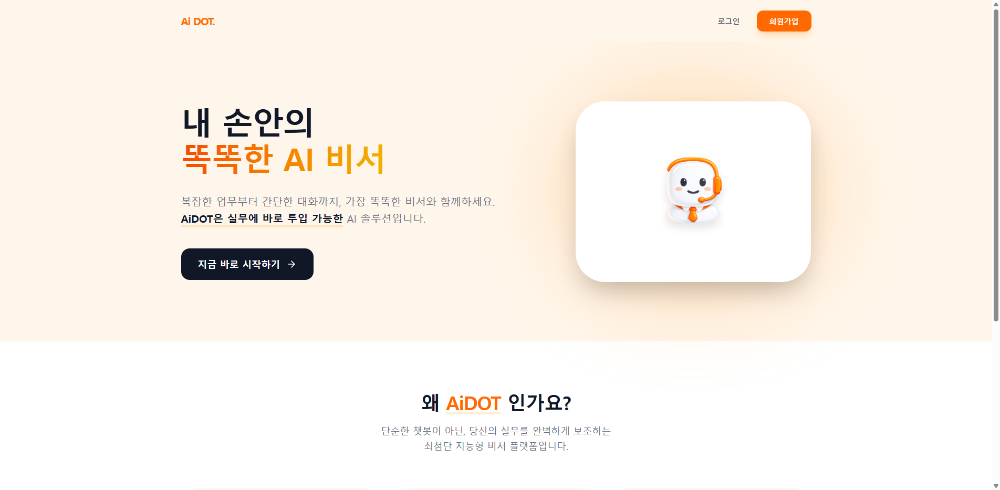

#### 화면 레이아웃

```
┌──────────────────────────────────────────────────────────────────┐
│                          Header                                   │
│    [Ai DOT. 로고]                       [로그인]  [회원가입]      │
├──────────────────────────────────────────────────────────────────┤
│                                                                   │
│                     Hero Section                                  │
│                                                                   │
│   ┌──────────────────────────────┬──────────────────────────┐    │
│   │                              │                          │    │
│   │     내 손안의                │     ┌──────────────┐     │    │
│   │     똑똑한 AI 비서           │     │              │     │    │
│   │                              │     │  [AI봇 이미지]│     │    │
│   │     복잡한 업무부터 간단한   │     │              │     │    │
│   │     대화까지, 가장 똑똑한    │     └──────────────┘     │    │
│   │     비서와 함께하세요.       │                          │    │
│   │                              │                          │    │
│   │  ┌────────────────────────┐  │                          │    │
│   │  │  지금 바로 시작하기 →  │  │                          │    │
│   │  └────────────────────────┘  │                          │    │
│   │                              │                          │    │
│   └──────────────────────────────┴──────────────────────────┘    │
│                                                                   │
├──────────────────────────────────────────────────────────────────┤
│                                                                   │
│                    Features Section                               │
│         왜 AiDOT 인가요?                                          │
│                                                                   │
│   ┌──────────────┐ ┌──────────────┐ ┌──────────────┐             │
│   │   [⚡]       │ │    [🧠]      │ │    [🛡]      │             │
│   │  압도적 속도  │ │  스마트 분석  │ │  철저한 보안  │             │
│   │              │ │              │ │              │             │
│   │  질문에 즉시  │ │  맥락을 깊이  │ │  모든 데이터는│             │
│   │  반응하고... │ │  이해하고... │ │  강력하게...  │             │
│   └──────────────┘ └──────────────┘ └──────────────┘             │
│                                                                   │
├──────────────────────────────────────────────────────────────────┤
│                          Footer                                   │
│              © 2026 Ai DOT. All rights reserved.                  │
└──────────────────────────────────────────────────────────────────┘
```

#### UI 구성요소

| 요소 ID | 유형 | 설명 | 속성 |
|---------|------|------|------|
| logo | Text | 서비스 로고 | "Ai DOT.", 오렌지색 텍스트 |
| link_login | Link | 로그인 페이지 이동 | to: /login |
| btn_signup_header | Button | 회원가입 페이지 이동 (헤더) | 오렌지 배경, 흰색 텍스트 |
| hero_title | Text | 메인 타이틀 | "내 손안의 똑똑한 AI 비서" |
| hero_desc | Text | 서비스 설명 | 서비스 소개 문구 |
| btn_cta | Button | CTA 버튼 | "지금 바로 시작하기", /signup 이동 |
| hero_image | Image | AI봇 이미지 | /icon/aibotIcon.png |
| feature_card_1 | Card | 기능 카드 1 | 아이콘: Zap, "압도적 속도" |
| feature_card_2 | Card | 기능 카드 2 | 아이콘: Brain, "스마트 분석" |
| feature_card_3 | Card | 기능 카드 3 | 아이콘: Shield, "철저한 보안" |

#### 이벤트 처리

| 이벤트 | 트리거 | 동작 |
|--------|--------|------|
| 로그인 이동 | link_login 클릭 | /login으로 이동 |
| 회원가입 이동 | btn_signup_header 또는 btn_cta 클릭 | /signup으로 이동 |
| 카드 호버 | feature_card 마우스 오버 | 호버 스타일 적용 (그림자, 아이콘 회전) |

---

### 3.1 로그인 페이지 (SCR-001)

| 항목 | 내용 |
|------|------|
| 화면 ID | SCR-001 |
| 화면명 | 로그인 |
| 경로 | /login |
| 관련 API | POST /api/login |
| 관련 요구사항 | UR-002 |
| 관련 유스케이스 | UC-AUTH-002 |
| 관련 테스트케이스 | TC-LGN-001 ~ TC-LGN-011 |

> **스크린샷**: 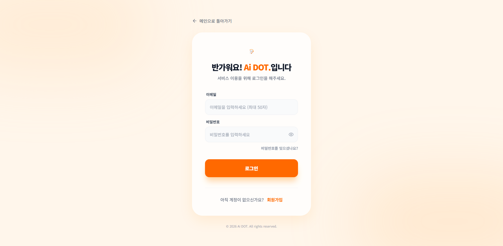

#### 화면 레이아웃

```
┌──────────────────────────────────────────────────────────────────┐
│                                                                   │
│     [← 메인으로 돌아가기]                                         │
│                                                                   │
│     ┌─────────────────────────────────────────────────────┐      │
│     │                                                      │      │
│     │              [Ai DOT 로고/아이콘]                    │      │
│     │                                                      │      │
│     │        반가워요! Ai DOT.입니다                       │      │
│     │     서비스 이용을 위해 로그인을 해주세요.            │      │
│     │                                                      │      │
│     │  이메일                                              │      │
│     │  ┌──────────────────────────────────────────┐       │      │
│     │  │ 이메일을 입력하세요 (최대 50자)          │       │      │
│     │  └──────────────────────────────────────────┘       │      │
│     │                                                      │      │
│     │  비밀번호                                            │      │
│     │  ┌──────────────────────────────────────┐[👁]       │      │
│     │  │ 비밀번호를 입력하세요                │           │      │
│     │  └──────────────────────────────────────┘           │      │
│     │                                                      │      │
│     │                    [비밀번호를 잊으셨나요?]          │      │
│     │                                                      │      │
│     │  ┌──────────────────────────────────────────┐       │      │
│     │  │              로  그  인                  │       │      │
│     │  └──────────────────────────────────────────┘       │      │
│     │                                                      │      │
│     │  ─────────────────────────────────────────────      │      │
│     │                                                      │      │
│     │      아직 계정이 없으신가요?  [회원가입]             │      │
│     │                                                      │      │
│     └─────────────────────────────────────────────────────┘      │
│                                                                   │
│                  © 2026 Ai DOT. All rights reserved.              │
│                                                                   │
└──────────────────────────────────────────────────────────────────┘
```

#### UI 구성요소

| 요소 ID | 유형 | 설명 | 속성 |
|---------|------|------|------|
| btn_back | Button | 메인 페이지 이동 | 텍스트: "메인으로 돌아가기" |
| input_email | Input | 이메일 입력 | type: email, maxLength: 50, required |
| input_password | Input | 비밀번호 입력 | type: password, maxLength: 20, required |
| btn_toggle_pw | IconButton | 비밀번호 표시/숨김 | icon: Eye/EyeOff |
| btn_login | Button | 로그인 실행 | Primary 색상, 로딩 상태 표시 |
| link_signup | Link | 회원가입 페이지 이동 | to: /signup |

#### 이벤트 처리

| 이벤트 | 트리거 | 동작 |
|--------|--------|------|
| 로그인 | btn_login 클릭 | 1. 입력값 검증<br>2. API 호출<br>3. 성공 시 역할별 페이지 이동 |
| 비밀번호 토글 | btn_toggle_pw 클릭 | input_password type 변경 |
| Enter 키 | input_password에서 Enter | 로그인 실행 |

---

### 3.2 회원가입 페이지 (SCR-002)

| 항목 | 내용 |
|------|------|
| 화면 ID | SCR-002 |
| 화면명 | 회원가입 |
| 경로 | /signup |
| 관련 API | POST /api/register, GET /api/depts |
| 관련 요구사항 | UR-001 |
| 관련 유스케이스 | UC-AUTH-001 |
| 관련 테스트케이스 | TC-SGN-001 ~ TC-SGN-015 |

> **스크린샷**: 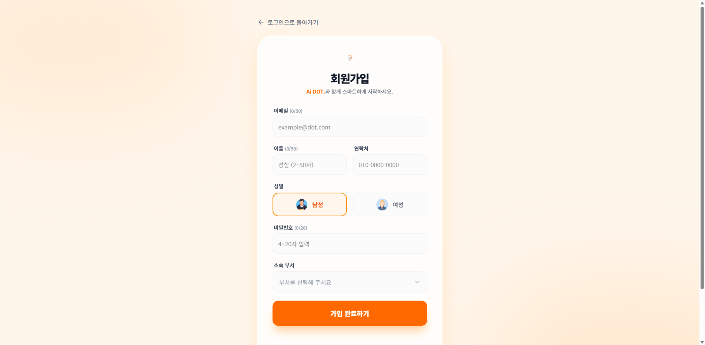

#### 화면 레이아웃

```
┌──────────────────────────────────────────────────────────────────┐
│                                                                   │
│     [← 로그인으로 돌아가기]                                       │
│                                                                   │
│     ┌─────────────────────────────────────────────────────┐      │
│     │              [Ai DOT 로고]                           │      │
│     │                 회원가입                              │      │
│     │       Ai DOT.과 함께 스마트하게 시작하세요.          │      │
│     │                                                      │      │
│     │  이메일 (0/50)                    ✓ 사용 가능        │      │
│     │  ┌──────────────────────────────────────────┐       │      │
│     │  │ example@dot.com                          │       │      │
│     │  └──────────────────────────────────────────┘       │      │
│     │                                                      │      │
│     │  이름 (0/50)               연락처                    │      │
│     │  ┌──────────────────┐     ┌──────────────────┐      │      │
│     │  │ 성함 (2~50자)    │     │ 010-0000-0000   │      │      │
│     │  └──────────────────┘     └──────────────────┘      │      │
│     │                                                      │      │
│     │  성별                                                │      │
│     │  ┌──────────────────┐     ┌──────────────────┐      │      │
│     │  │ [👤] 남성       │     │ [👤] 여성       │      │      │
│     │  └──────────────────┘     └──────────────────┘      │      │
│     │                                                      │      │
│     │  비밀번호 (0/20)                  ✓ 사용 가능        │      │
│     │  ┌──────────────────────────────────────────┐       │      │
│     │  │ 4~20자 입력                              │       │      │
│     │  └──────────────────────────────────────────┘       │      │
│     │                                                      │      │
│     │  소속 부서                                           │      │
│     │  ┌──────────────────────────────────────────┐       │      │
│     │  │ 부서를 선택해 주세요                  ▼  │       │      │
│     │  └──────────────────────────────────────────┘       │      │
│     │                                                      │      │
│     │  ┌──────────────────────────────────────────┐       │      │
│     │  │            가 입 완 료 하 기             │       │      │
│     │  └──────────────────────────────────────────┘       │      │
│     │                                                      │      │
│     │      이미 계정이 있으신가요?  [로그인]               │      │
│     └─────────────────────────────────────────────────────┘      │
│                                                                   │
└──────────────────────────────────────────────────────────────────┘
```

#### UI 구성요소

| 요소 ID | 유형 | 설명 | 속성 |
|---------|------|------|------|
| input_email | Input | 이메일 입력 | maxLength: 50, 실시간 검증 |
| input_name | Input | 이름 입력 | maxLength: 50, min: 2 |
| input_phone | Input | 연락처 입력 | maxLength: 13, 자동 하이픈 |
| radio_gender | RadioGroup | 성별 선택 | options: M/F |
| input_password | Input | 비밀번호 입력 | maxLength: 20, min: 4 |
| btn_dept | Button | 부서 선택 모달 열기 | 선택 시 부서명 표시 |
| btn_submit | Button | 회원가입 실행 | 검증 실패 시 비활성화 |

#### 실시간 검증

| 필드 | 검증 규칙 | 표시 |
|------|----------|------|
| 이메일 | 형식 검증 + 50자 제한 | ✓ 사용 가능 / ✗ 오류 메시지 |
| 이름 | 2자 이상 | 미충족 시 빨간 테두리 |
| 비밀번호 | 4~20자 | ✓ 사용 가능 / ✗ 오류 메시지 |

---

### 3.3 홈 페이지 (SCR-003)

| 항목 | 내용 |
|------|------|
| 화면 ID | SCR-003 |
| 화면명 | 홈 |
| 경로 | /home |
| 관련 API | GET /user/{id}/home-data |
| 관련 요구사항 | UR-005 |
| 관련 유스케이스 | UC-USER-001 |
| 관련 테스트케이스 | TC-HOM-001 ~ TC-HOM-014 |

> **스크린샷**: 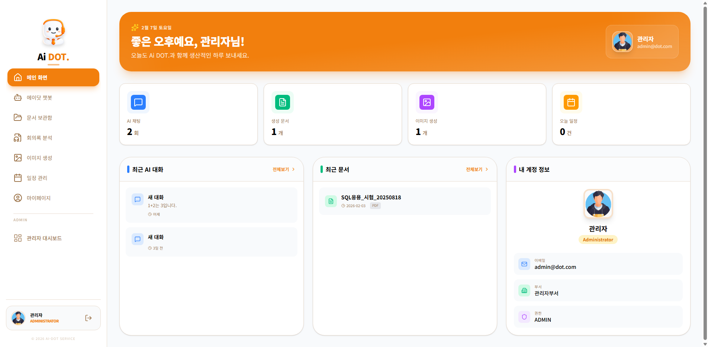

#### 화면 레이아웃

```
┌─────────────────────────────────────────────────────────────────────────┐
│ [Sidebar]                                                                │
├────────────┬────────────────────────────────────────────────────────────┤
│            │                                                             │
│  홈        │  좋은 아침이에요, 홍길동님! 👋                              │
│  AI챗봇    │  오늘도 Ai DOT.와 함께 스마트하게 일해보세요.               │
│  이미지    │                                                             │
│  문서      │  ┌────────────┐ ┌────────────┐ ┌────────────┐ ┌────────────┐│
│  회의록    │  │ 💬 AI채팅  │ │ 📄 생성문서│ │ 🖼️ 이미지 │ │ 📅 오늘일정 ││
│  일정      │  │    12      │ │     8      │ │     5      │ │     3      ││
│            │  │    회      │ │     건      │ │     장     │ │     건     ││
│            │  └────────────┘ └────────────┘ └────────────┘ └────────────┘│
│            │                                                             │
│            │  ┌─────────────────────────────┐ ┌─────────────────────────┐│
│            │  │ 최근 AI 대화                │ │ 내 정보               │ │
│            │  ├─────────────────────────────┤ ├─────────────────────────┤│
│            │  │ • 프로젝트 일정 문의...     │ │ [아바타]               ││
│            │  │ • 회의록 요약 부탁...       │ │ 홍길동                  ││
│            │  │ • 마케팅 자료 검색...       │ │ hong@company.com        ││
│            │  └─────────────────────────────┘ │ 개발팀 | USER           ││
│            │                                   └─────────────────────────┘│
│            │  ┌─────────────────────────────────────────────────────────┐│
│            │  │ 최근 문서                                               ││
│            │  ├─────────────────────────────────────────────────────────┤│
│            │  │ [PDF] 프로젝트 계획서          2026-01-20              ││
│            │  │ [DOC] 회의록_20260119          2026-01-19              ││
│            │  └─────────────────────────────────────────────────────────┘│
│ [사용자]   │                                                             │
│ [로그아웃] │                                                             │
└────────────┴────────────────────────────────────────────────────────────┘
```

#### UI 구성요소

| 요소 ID | 유형 | 설명 |
|---------|------|------|
| greeting | Text | 시간대별 인사말 + 사용자명 |
| stat_cards | CardGroup | 4개 통계 카드 (채팅, 문서, 이미지, 일정) |
| recent_chats | List | 최근 3개 AI 대화 (클릭 시 해당 세션으로 이동) |
| recent_docs | List | 최근 3개 문서 |
| profile_card | Card | 사용자 프로필 정보 |

---

### 3.4 마이페이지 (SCR-004)

| 항목 | 내용 |
|------|------|
| 화면 ID | SCR-004 |
| 화면명 | 마이페이지 |
| 경로 | /mypage |
| 관련 API | GET /user/{id}/mypage-data, PUT /user/{id}/profile, PUT /user/{id}/password |
| 관련 요구사항 | UR-004, UR-005 |
| 관련 유스케이스 | UC-USER-001 |
| 관련 테스트케이스 | TC-MYP-001 ~ TC-MYP-014 |

> **스크린샷**: 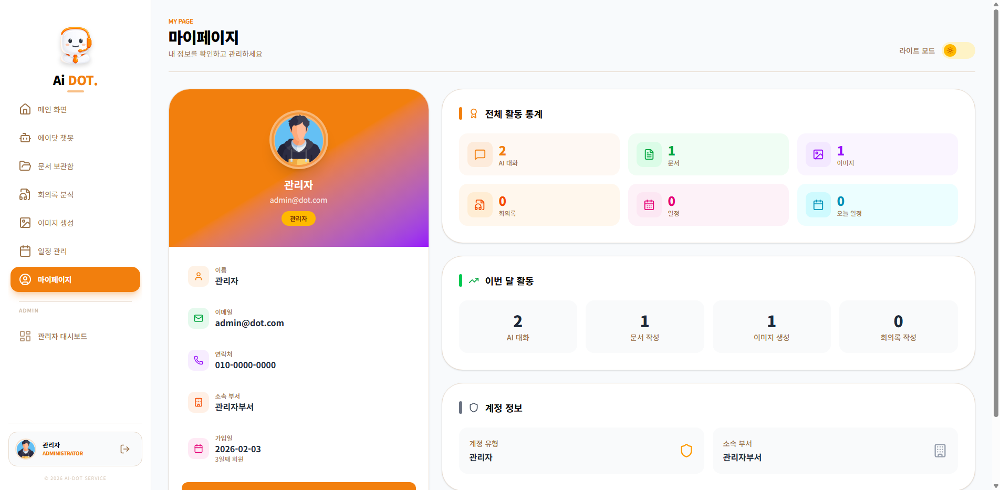

#### 화면 레이아웃

```
┌─────────────────────────────────────────────────────────────────────────┐
│ [Sidebar]                                                                │
├────────────┬────────────────────────────────────────────────────────────┤
│            │  MY PAGE                                                    │
│            │  마이페이지                                                 │
│            │                                                             │
│            │  ┌─────────────────────────────────────────────────────────┐│
│            │  │ 프로필                                      [수정]     ││
│            │  │                                                         ││
│            │  │  [아바타]   홍길동                                      ││
│            │  │             hong@company.com                            ││
│            │  │             개발팀                                      ││
│            │  │             가입일: 2026-01-01                          ││
│            │  │             역할: 일반 사용자                           ││
│            │  └─────────────────────────────────────────────────────────┘│
│            │                                                             │
│            │  ┌──────────────────────┐ ┌──────────────────────┐         │
│            │  │ 전체 활동            │ │ 이번 달 활동         │         │
│            │  │                      │ │                      │         │
│            │  │ AI대화  문서  이미지 │ │ 채팅 12 | 문서 5    │         │
│            │  │   45     32     18   │ │ 이미지 3 | 일정 8   │         │
│            │  │ 회의록  일정         │ │                      │         │
│            │  │   8      25          │ │                      │         │
│            │  └──────────────────────┘ └──────────────────────┘         │
│            │                                                             │
│            │  ┌──────────────────────┐ ┌──────────────────────┐         │
│            │  │ 계정 정보            │ │ 보안                 │         │
│            │  │                      │ │                      │         │
│            │  │ 역할: USER           │ │ [비밀번호 변경]      │         │
│            │  │ 부서: 개발팀         │ │                      │         │
│            │  └──────────────────────┘ └──────────────────────┘         │
│            │                                                             │
└────────────┴────────────────────────────────────────────────────────────┘
```

#### 프로필 수정 모드

```
┌─────────────────────────────────────────────────────────────────┐
│ 프로필 수정                                        [저장] [취소]│
│                                                                 │
│  이름 (2/50)                                                    │
│  ┌──────────────────────────────────────────┐                  │
│  │ 홍길동                                    │                  │
│  └──────────────────────────────────────────┘                  │
│                                                                 │
│  연락처                                                         │
│  ┌──────────────────────────────────────────┐                  │
│  │ 010-1234-5678                             │                  │
│  └──────────────────────────────────────────┘                  │
└─────────────────────────────────────────────────────────────────┘
```

#### 비밀번호 변경 모달

```
┌─────────────────────────────────────────────────────────────────┐
│ 비밀번호 변경                                              [X] │
├─────────────────────────────────────────────────────────────────┤
│                                                                 │
│  현재 비밀번호                                                  │
│  ┌──────────────────────────────────────────┐                  │
│  │ ••••••••                                  │                  │
│  └──────────────────────────────────────────┘                  │
│                                                                 │
│  새 비밀번호 (4~20자)                                          │
│  ┌──────────────────────────────────────────┐                  │
│  │                                           │                  │
│  └──────────────────────────────────────────┘                  │
│                                                                 │
│                              [취소]  [변경하기]                 │
└─────────────────────────────────────────────────────────────────┘
```

---

### 3.5 AI 챗봇 페이지 (SCR-005)

| 항목 | 내용 |
|------|------|
| 화면 ID | SCR-005 |
| 화면명 | AI 챗봇 |
| 경로 | /chatbot |
| 관련 API | /chat/sessions/*, /ai/chat/* |
| 관련 요구사항 | CR-001, CR-002, CR-003 |
| 관련 유스케이스 | UC-CHAT-001 |
| 관련 테스트케이스 | TC-CHT-001 ~ TC-CHT-017 |

> **스크린샷**: 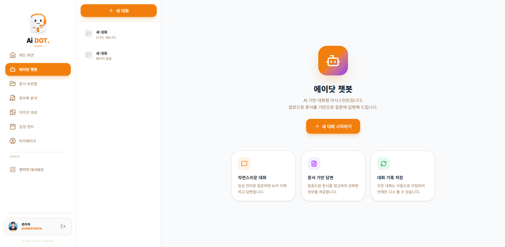

#### 화면 레이아웃

```
┌─────────────────────────────────────────────────────────────────────────┐
│ [Sidebar]                                                                │
├────────────┬───────────────────────────────────┬────────────────────────┤
│            │ ┌───────────────────────────────┐ │                        │
│            │ │ [+ 새 대화]                   │ │   ┌────────────────┐   │
│            │ └───────────────────────────────┘ │   │ [🤖]           │   │
│            │                                   │   │  안녕하세요!   │   │
│            │ 세션 목록                         │   │  무엇을 도와   │   │
│            │ ┌───────────────────────────────┐ │   │  드릴까요?     │   │
│            │ │ [💬] 프로젝트 일정 문의  [⋮] │ │   └────────────────┘   │
│            │ │      어제 3:24 PM             │ │                        │
│            │ ├───────────────────────────────┤ │   ┌────────────────┐   │
│            │ │ [💬] 회의록 요약 부탁    [⋮] │ │   │           [👤] │   │
│            │ │      1월 18일                 │ │   │  프로젝트 일정 │   │
│            │ ├───────────────────────────────┤ │   │  알려주세요    │   │
│            │ │ [💬] 마케팅 자료 검색    [⋮] │ │   └────────────────┘   │
│            │ │      1월 15일                 │ │                        │
│            │ └───────────────────────────────┘ │   ┌────────────────┐   │
│            │                                   │   │ [🤖]           │   │
│            │                                   │   │  네, 프로젝트  │   │
│            │                                   │   │  일정을 확인   │   │
│            │                                   │   │  해드리겠습... │   │
│            │                                   │   │                │   │
│            │                                   │   │ 📄 참고 문서   │   │
│            │                                   │   │ • project.pdf  │   │
│            │                                   │   └────────────────┘   │
│            │                                   │                        │
│            │                                   │ ┌──────────────────────┤
│            │                                   │ │ 메시지 입력...   [▶]│
│            │                                   │ └──────────────────────┤
└────────────┴───────────────────────────────────┴────────────────────────┘
```

#### 세션 메뉴

```
┌─────────────────┐
│ ✏️ 이름 변경   │
│ 🗑️ 삭제        │
└─────────────────┘
```

#### 세션 제목 수정 모드

```
┌─────────────────────────────────────────────────────────────────┐
│ ┌────────────────────────────────────────┐ [✓] [✗]             │
│ │ 새 제목 입력 (최대 255자)              │                     │
│ └────────────────────────────────────────┘                     │
└─────────────────────────────────────────────────────────────────┘
```

#### 메시지 영역 상태

| 상태 | 표시 |
|------|------|
| 로딩 중 | 스피너 + "대화 내역을 불러오는 중..." |
| 빈 대화 | "아직 대화가 없습니다" 안내 |
| AI 응답 중 | 점 3개 애니메이션 + "생각 중..." |
| 스트리밍 | 실시간 텍스트 표시 |

---

### 3.6 이미지 생성 페이지 (SCR-006)

| 항목 | 내용 |
|------|------|
| 화면 ID | SCR-006 |
| 화면명 | AI 이미지 생성 |
| 경로 | /images |
| 관련 API | GET /image/list/{id}, POST /image/generate, DELETE /image/{id} |
| 관련 요구사항 | IR-001, IR-002 |
| 관련 유스케이스 | UC-IMG-001 |
| 관련 테스트케이스 | TC-IMG-001 ~ TC-IMG-014 |

> **스크린샷**: 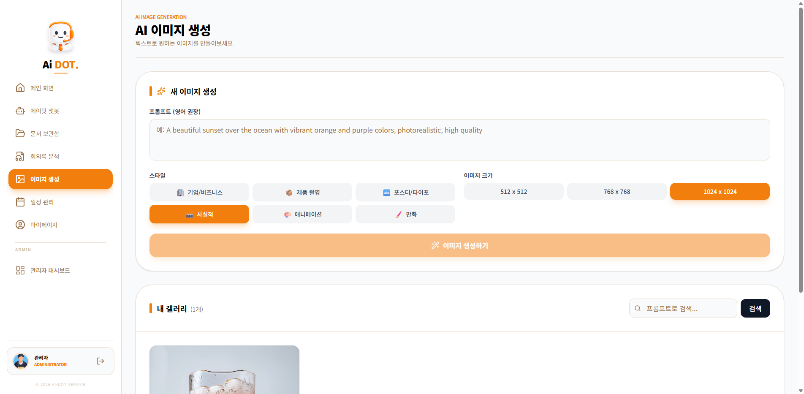

#### 화면 레이아웃

```
┌─────────────────────────────────────────────────────────────────────────┐
│ [Sidebar]                                                                │
├────────────┬────────────────────────────────────────────────────────────┤
│            │  IMAGE GENERATOR                                            │
│            │  AI 이미지 생성                                             │
│            │                                                             │
│            │  ┌─────────────────────────────────────────────────────────┐│
│            │  │ 이미지 생성하기                                         ││
│            │  │                                                         ││
│            │  │ 프롬프트 (영어 권장)                                    ││
│            │  │ ┌─────────────────────────────────────────────────────┐││
│            │  │ │ A beautiful sunset over mountains...               │││
│            │  │ └─────────────────────────────────────────────────────┘││
│            │  │                                                         ││
│            │  │ 스타일      ┌──────┐┌──────┐┌──────┐┌──────┐          ││
│            │  │            │사실적││애니메││만화 ││스케치│          ││
│            │  │            └──────┘└──────┘└──────┘└──────┘          ││
│            │  │                                                         ││
│            │  │ 크기        [512x512 ▼]                                 ││
│            │  │                                                         ││
│            │  │ [✨ 생성하기]                                           ││
│            │  └─────────────────────────────────────────────────────────┘│
│            │                                                             │
│            │  내 갤러리                              [🔍 검색]           │
│            │  ┌────────┐ ┌────────┐ ┌────────┐ ┌────────┐              │
│            │  │ [IMG]  │ │ [IMG]  │ │ [IMG]  │ │ [IMG]  │              │
│            │  │        │ │        │ │        │ │        │              │
│            │  │ [👁][⬇]│ │ [👁][⬇]│ │ [👁][⬇]│ │ [👁][⬇]│              │
│            │  │ [🗑]   │ │ [🗑]   │ │ [🗑]   │ │ [🗑]   │              │
│            │  └────────┘ └────────┘ └────────┘ └────────┘              │
│            │                                                             │
│            │           [<] [1] [2] [3] [>]                              │
└────────────┴────────────────────────────────────────────────────────────┘
```

#### 이미지 상세 모달

```
┌─────────────────────────────────────────────────────────────────┐
│ 이미지 상세                                                [X] │
├─────────────────────────────────────────────────────────────────┤
│                                                                 │
│  ┌─────────────────────────────────────────────────────────┐   │
│  │                                                         │   │
│  │                    [큰 이미지]                          │   │
│  │                                                         │   │
│  └─────────────────────────────────────────────────────────┘   │
│                                                                 │
│  프롬프트: A beautiful sunset over mountains...                 │
│  스타일: 사실적                                                 │
│  크기: 512x512                                                  │
│  생성일: 2026-01-20 14:30                                       │
│                                                                 │
│                              [다운로드]  [삭제]                 │
└─────────────────────────────────────────────────────────────────┘
```

---

### 3.7 문서 보관함 페이지 (SCR-007)

| 항목 | 내용 |
|------|------|
| 화면 ID | SCR-007 |
| 화면명 | 문서 보관함 |
| 경로 | /documents |
| 관련 API | /document/* |
| 관련 요구사항 | DR-001, DR-002, DR-003 |
| 관련 유스케이스 | UC-DOC-001, UC-DOC-002 |
| 관련 테스트케이스 | TC-DOC-001 ~ TC-DOC-018 |

> **스크린샷**: 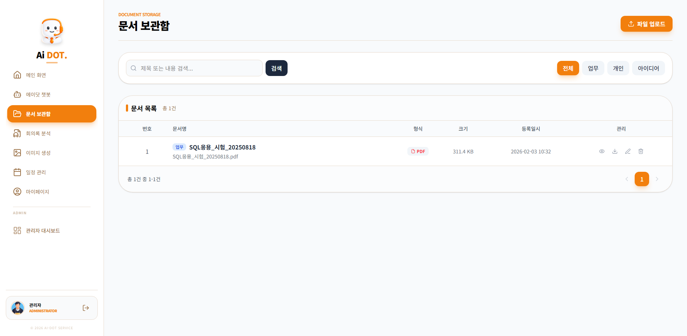

#### 화면 레이아웃

```
┌─────────────────────────────────────────────────────────────────────────┐
│ [Sidebar]                                                                │
├────────────┬────────────────────────────────────────────────────────────┤
│            │  DOCUMENT STORAGE                        [📤 파일 업로드]  │
│            │  문서 보관함                                                │
│            │                                                             │
│            │  ┌─────────────────────────────────────────────────────────┐│
│            │  │ [🔍 검색...]  [검색]        [전체][업무][개인][아이디어]││
│            │  └─────────────────────────────────────────────────────────┘│
│            │                                                             │
│            │  ┌─────────────────────────────────────────────────────────┐│
│            │  │ 📄 문서 목록                              총 32건      ││
│            │  ├─────────────────────────────────────────────────────────┤│
│            │  │  #  │ 문서명              │ 형식 │ 크기  │ 등록일 │관리││
│            │  ├─────────────────────────────────────────────────────────┤│
│            │  │  1  │ [업무] 프로젝트계획 │ PDF  │ 2.5MB│ 01-20 │[⋮] ││
│            │  │  2  │ [개인] 회의록정리   │ DOC  │ 500KB│ 01-19 │[⋮] ││
│            │  │  3  │ [업무] 마케팅자료   │ PPT  │ 5.2MB│ 01-18 │[⋮] ││
│            │  │  4  │ [아이디어] 신규기능 │ TXT  │ 10KB │ 01-17 │[⋮] ││
│            │  │ ... │ ...                 │ ...  │ ...  │ ...   │    ││
│            │  └─────────────────────────────────────────────────────────┘│
│            │                                                             │
│            │       총 32건 중 1-10건        [<] [1][2][3][4] [>]         │
└────────────┴────────────────────────────────────────────────────────────┘
```

#### 문서 업로드 모달

```
┌─────────────────────────────────────────────────────────────────┐
│ 파일 업로드                                                [X] │
├─────────────────────────────────────────────────────────────────┤
│                                                                 │
│  파일 선택                                                      │
│  ┌─────────────────────────────────────────────────────────┐   │
│  │                                                         │   │
│  │     [📁] 클릭하여 파일을 선택하세요                     │   │
│  │         PDF, DOC, DOCX, XLS, PPT, TXT, HWP              │   │
│  │                                                         │   │
│  └─────────────────────────────────────────────────────────┘   │
│                                                                 │
│  제목 (0/255)                                                   │
│  ┌─────────────────────────────────────────────────────────┐   │
│  │ 문서 제목을 입력하세요                                  │   │
│  └─────────────────────────────────────────────────────────┘   │
│                                                                 │
│  카테고리                                                       │
│  [업무 ▼]                                                       │
│                                                                 │
│  요약 (선택)                                                    │
│  ┌─────────────────────────────────────────────────────────┐   │
│  │ 문서에 대한 간단한 설명                                 │   │
│  └─────────────────────────────────────────────────────────┘   │
│                                                                 │
│                              [취소]  [📤 업로드]                │
└─────────────────────────────────────────────────────────────────┘
```

#### 관리 버튼 메뉴

| 버튼 | 아이콘 | 동작 |
|------|--------|------|
| 보기 | 👁 | 상세 모달 표시 |
| 다운로드 | ⬇ | 파일 다운로드 |
| 수정 | ✏️ | 수정 모달 표시 |
| 삭제 | 🗑️ | 삭제 확인 후 삭제 |

---

### 3.8 회의록 분석 페이지 (SCR-008)

| 항목 | 내용 |
|------|------|
| 화면 ID | SCR-008 |
| 화면명 | 회의록 분석 |
| 경로 | /meeting |
| 관련 API | /meeting/* |
| 관련 요구사항 | MR-001, MR-002, MR-003 |
| 관련 유스케이스 | UC-MTG-001, UC-MTG-002 |
| 관련 테스트케이스 | TC-MTG-001 ~ TC-MTG-015 |

> **스크린샷**: 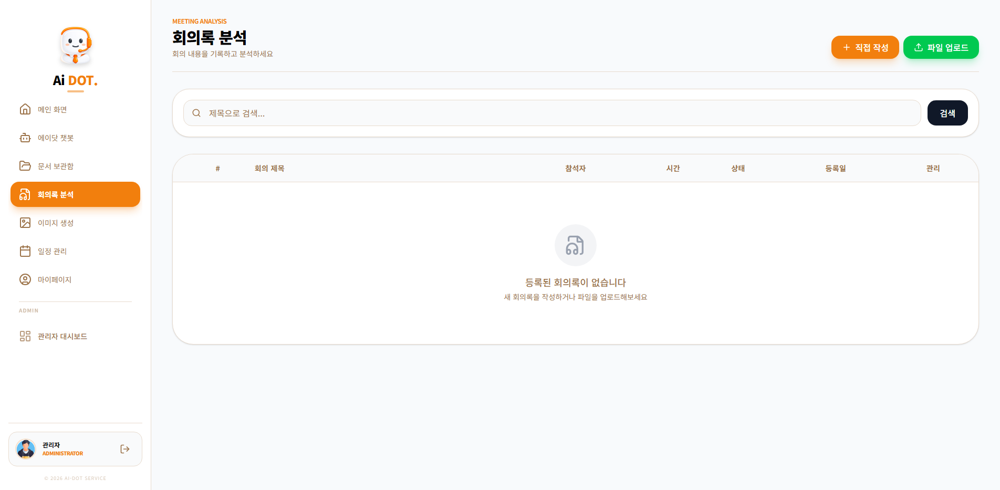

#### 화면 레이아웃

```
┌─────────────────────────────────────────────────────────────────────────┐
│ [Sidebar]                                                                │
├────────────┬────────────────────────────────────────────────────────────┤
│            │  MEETING ANALYSIS             [✏️ 직접작성] [📤 파일업로드]│
│            │  회의록 분석                                                │
│            │  회의 내용을 기록하고 분석하세요                            │
│            │                                                             │
│            │  ┌─────────────────────────────────────────────────────────┐│
│            │  │ [🔍 제목으로 검색...]  [검색]                          ││
│            │  └─────────────────────────────────────────────────────────┘│
│            │                                                             │
│            │  ┌─────────────────────────────────────────────────────────┐│
│            │  │  #  │ 회의 제목         │참석자│시간│상태  │등록일│관리││
│            │  ├─────────────────────────────────────────────────────────┤│
│            │  │  1  │ 프로젝트 킥오프   │ 5명  │60분│✅완료│01-20│[⋮]││
│            │  │  2  │ 주간 스프린트     │ 3명  │30분│🔄처리중│01-19│[⋮]││
│            │  │  3  │ 디자인 리뷰       │ 4명  │45분│⏳대기│01-18│[⋮]││
│            │  │  4  │ 고객 미팅         │ 2명  │ - │❌오류│01-17│[⋮]││
│            │  └─────────────────────────────────────────────────────────┘│
│            │                                                             │
│            │       총 15건 중 1-10건        [<] [1][2] [>]               │
└────────────┴────────────────────────────────────────────────────────────┘
```

#### 상태 표시

| 상태 | 배지 | 색상 |
|------|------|------|
| QUEUED | ⏳ 대기중 | 노랑 |
| PROCESSING | 🔄 처리중 | 파랑 (회전) |
| COMPLETED | ✅ 완료 | 초록 |
| ERROR | ❌ 오류 | 빨강 |

#### 회의록 작성 모달

```
┌─────────────────────────────────────────────────────────────────┐
│ 회의록 직접 작성                                           [X] │
├─────────────────────────────────────────────────────────────────┤
│                                                                 │
│  회의 제목 (0/255)                                              │
│  ┌─────────────────────────────────────────────────────────┐   │
│  │ 회의 제목을 입력하세요                                  │   │
│  └─────────────────────────────────────────────────────────┘   │
│                                                                 │
│  참석자 (쉼표로 구분)                                          │
│  ┌─────────────────────────────────────────────────────────┐   │
│  │ 예: 홍길동, 김철수, 이영희                              │   │
│  └─────────────────────────────────────────────────────────┘   │
│                                                                 │
│  회의 시간 (분)                                                 │
│  ┌───────────────┐                                             │
│  │ 30            │                                             │
│  └───────────────┘                                             │
│                                                                 │
│  회의 내용 (전문)                                               │
│  ┌─────────────────────────────────────────────────────────┐   │
│  │                                                         │   │
│  │ 회의 내용을 입력하세요                                  │   │
│  │                                                         │   │
│  └─────────────────────────────────────────────────────────┘   │
│                                                                 │
│  요약                                                           │
│  ┌─────────────────────────────────────────────────────────┐   │
│  │ 회의 요약을 입력하세요                                  │   │
│  └─────────────────────────────────────────────────────────┘   │
│                                                                 │
│                              [취소]  [등록]                     │
└─────────────────────────────────────────────────────────────────┘
```

---

### 3.9 일정 관리 페이지 (SCR-009)

| 항목 | 내용 |
|------|------|
| 화면 ID | SCR-009 |
| 화면명 | 일정 관리 |
| 경로 | /schedule |
| 관련 API | /schedule/* |
| 관련 요구사항 | SR-001, SR-002, SR-003 |
| 관련 유스케이스 | UC-SCH-001 |
| 관련 테스트케이스 | TC-SCH-001 ~ TC-SCH-015 |

> **스크린샷**: 

#### 화면 레이아웃

```
┌─────────────────────────────────────────────────────────────────────────┐
│ [Sidebar]                                                                │
├────────────┬────────────────────────────────────────────────────────────┤
│            │  SCHEDULE                                                   │
│            │  일정 관리                                                  │
│            │                                                             │
│            │  ┌──────────────────────────────────────┬──────────────────┐│
│            │  │     [<]  2026년 1월  [>]   [오늘]   │ 2026.01.22 (수)  ││
│            │  │                                      │                  ││
│            │  │  일  월  화  수  목  금  토          │ 오늘의 일정      ││
│            │  │ ──────────────────────────          │ ┌──────────────┐ ││
│            │  │                 1   2   3   4        │ │[업무] 팀미팅 │ ││
│            │  │  5   6   7   8   9  10  11          │ │  09:00-10:00 │ ││
│            │  │ 12  13  14  15  16  17  18          │ └──────────────┘ ││
│            │  │ 19  20  21 [22] 23  24  25          │ ┌──────────────┐ ││
│            │  │           (3)                        │ │[회의] 고객콜 │ ││
│            │  │ 26  27  28  29  30  31              │ │  14:00-15:00 │ ││
│            │  │                                      │ └──────────────┘ ││
│            │  │                                      │ ┌──────────────┐ ││
│            │  │                                      │ │[개인] 운동   │ ││
│            │  │                                      │ │  18:00-19:00 │ ││
│            │  │                                      │ └──────────────┘ ││
│            │  │                                      │                  ││
│            │  │                                      │ [+ 일정 추가]    ││
│            │  └──────────────────────────────────────┴──────────────────┘│
└────────────┴────────────────────────────────────────────────────────────┘
```

#### 캘린더 날짜 표시

- 오늘: 파란 원형 배경
- 선택된 날짜: primary 색상 배경
- 일정 있는 날짜: 하단에 일정 개수 뱃지

#### 일정 등록 모달

```
┌─────────────────────────────────────────────────────────────────┐
│ 새 일정                                                    [X] │
├─────────────────────────────────────────────────────────────────┤
│                                                                 │
│  일정 제목 (0/100)                                              │
│  ┌─────────────────────────────────────────────────────────┐   │
│  │ 일정 제목을 입력하세요                                  │   │
│  └─────────────────────────────────────────────────────────┘   │
│                                                                 │
│  날짜                                                           │
│  [2026-01-22]                                                   │
│                                                                 │
│  시간                                                           │
│  [09:00 ▼] ~ [10:00 ▼]                                         │
│                                                                 │
│  카테고리                                                       │
│  [일반][업무][회의][개인][중요]                                 │
│                                                                 │
│  상세 내용 (선택)                                               │
│  ┌─────────────────────────────────────────────────────────┐   │
│  │                                                         │   │
│  └─────────────────────────────────────────────────────────┘   │
│                                                                 │
│                              [취소]  [등록]                     │
└─────────────────────────────────────────────────────────────────┘
```

#### 카테고리 색상

| 카테고리 | 색상 |
|----------|------|
| 일반 | 회색 |
| 업무 | 파랑 |
| 회의 | 초록 |
| 개인 | 보라 |
| 중요 | 빨강 |

---

### 3.10 관리자 대시보드 (SCR-010)

| 항목 | 내용 |
|------|------|
| 화면 ID | SCR-010 |
| 화면명 | 관리자 대시보드 |
| 경로 | /dashboard |
| 접근 권한 | ADMIN |
| 관련 요구사항 | AR-001 |
| 관련 유스케이스 | UC-ADM-001 |
| 관련 테스트케이스 | TC-DSH-001 ~ TC-DSH-011 |

> **스크린샷**: 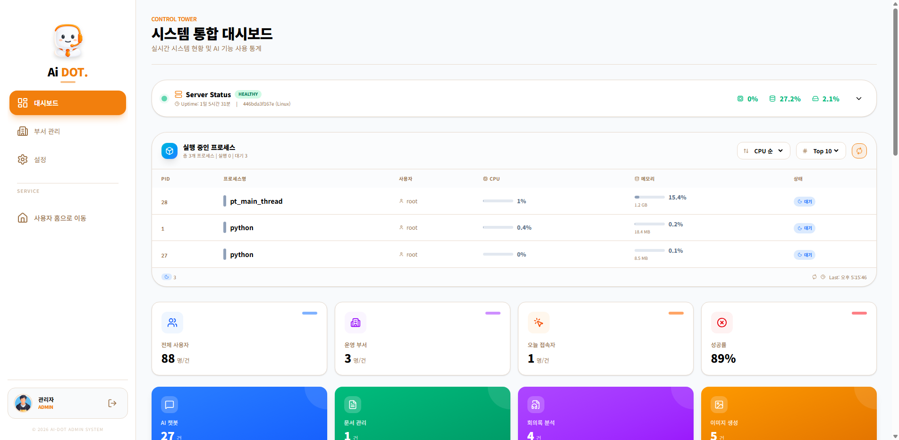

#### 화면 레이아웃

```
┌─────────────────────────────────────────────────────────────────────────┐
│ [Admin Sidebar]                                                          │
├────────────┬────────────────────────────────────────────────────────────┤
│            │  DASHBOARD                                                  │
│ 대시보드   │  시스템 대시보드                                            │
│ 사용자관리 │                                                             │
│ 부서관리   │  ┌───────────────────────────────────────────────┐         │
│            │  │ 서버 상태                                     │         │
│            │  │ CPU [████████░░] 80%                          │         │
│            │  │ MEM [██████░░░░] 60%                          │         │
│            │  │ DSK [████░░░░░░] 40%                          │         │
│            │  └───────────────────────────────────────────────┘         │
│            │                                                             │
│            │  ┌─────────┐ ┌─────────┐ ┌─────────┐ ┌─────────┐          │
│            │  │ 사용자  │ │ 문서    │ │ 이미지  │ │ 회의록  │          │
│            │  │  156    │ │  1,234  │ │   567   │ │   89    │          │
│            │  └─────────┘ └─────────┘ └─────────┘ └─────────┘          │
│            │                                                             │
│            │  ┌───────────────────────┐ ┌───────────────────────┐       │
│            │  │ 일별 활동 추이        │ │ AI 기능 사용 현황     │       │
│            │  │ [라인 차트]           │ │ [바 차트]             │       │
│            │  └───────────────────────┘ └───────────────────────┘       │
│            │                                                             │
│            │  ┌───────────────────────┐ ┌───────────────────────┐       │
│            │  │ 부서별 인원           │ │ 부서별 활동           │       │
│            │  │ [파이 차트]           │ │ [막대 차트]           │       │
│            │  └───────────────────────┘ └───────────────────────┘       │
│            │                                                             │
│            │  ┌─────────────────────────────────────────────────────────┐│
│            │  │ 시스템 로그                               🔴 LIVE      ││
│            │  ├─────────────────────────────────────────────────────────┤│
│            │  │ 2026-01-22 10:30 | 홍길동 | LOGIN | SUCCESS            ││
│            │  │ 2026-01-22 10:28 | 김철수 | AI_CHAT | SUCCESS          ││
│            │  │ 2026-01-22 10:25 | 이영희 | DOC_UPLOAD | SUCCESS       ││
│            │  └─────────────────────────────────────────────────────────┘│
└────────────┴────────────────────────────────────────────────────────────┘
```

---

### 3.11 사용자 관리 페이지 (SCR-011)

| 항목 | 내용 |
|------|------|
| 화면 ID | SCR-011 |
| 화면명 | 사용자 관리 |
| 경로 | /admin/settings |
| 접근 권한 | ADMIN |
| 관련 요구사항 | AR-002 |
| 관련 유스케이스 | UC-ADM-002 |
| 관련 테스트케이스 | TC-ADU-001 ~ TC-ADU-008 |

> **스크린샷**: 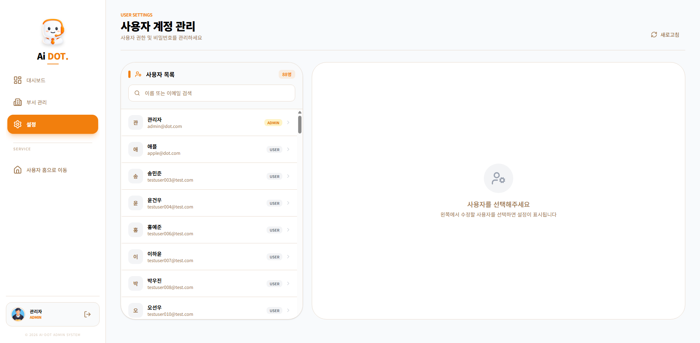

#### 화면 레이아웃

```
┌─────────────────────────────────────────────────────────────────────────┐
│ [Admin Sidebar]                                                          │
├────────────┬────────────────────────────────┬───────────────────────────┤
│            │ 사용자 관리                    │ 사용자 상세               │
│ 대시보드   │                                │                           │
│ 사용자관리 │ [🔍 검색...]                   │ ┌───────────────────────┐ │
│ 부서관리   │                                │ │ [아바타]              │ │
│            │ ┌────────────────────────────┐ │ │ 홍길동                │ │
│            │ │ 홍길동                     │ │ │ hong@company.com      │ │
│            │ │ hong@company.com   [USER]  │ │ │                       │ │
│            │ ├────────────────────────────┤ │ │ 부서: 개발팀          │ │
│            │ │ 김철수                     │ │ │ 가입일: 2026-01-01    │ │
│            │ │ kim@company.com    [ADMIN] │ │ └───────────────────────┘ │
│            │ ├────────────────────────────┤ │                           │
│            │ │ 이영희                     │ │ 권한 설정                 │
│            │ │ lee@company.com    [USER]  │ │ [ ] USER   [✓] ADMIN     │
│            │ ├────────────────────────────┤ │                           │
│            │ │ ...                        │ │ 비밀번호 초기화           │
│            │ └────────────────────────────┘ │ [새 비밀번호...]          │
│            │                                │                           │
│            │                                │ [저장하기]                │
│            │                                │                           │
└────────────┴────────────────────────────────┴───────────────────────────┘
```

---

### 3.12 부서 관리 페이지 (SCR-012)

| 항목 | 내용 |
|------|------|
| 화면 ID | SCR-012 |
| 화면명 | 부서 관리 |
| 경로 | /admin/depts |
| 접근 권한 | ADMIN |
| 관련 요구사항 | AR-003 |
| 관련 유스케이스 | UC-ADM-003 |
| 관련 테스트케이스 | TC-DPT-001 ~ TC-DPT-007 |

> **스크린샷**: 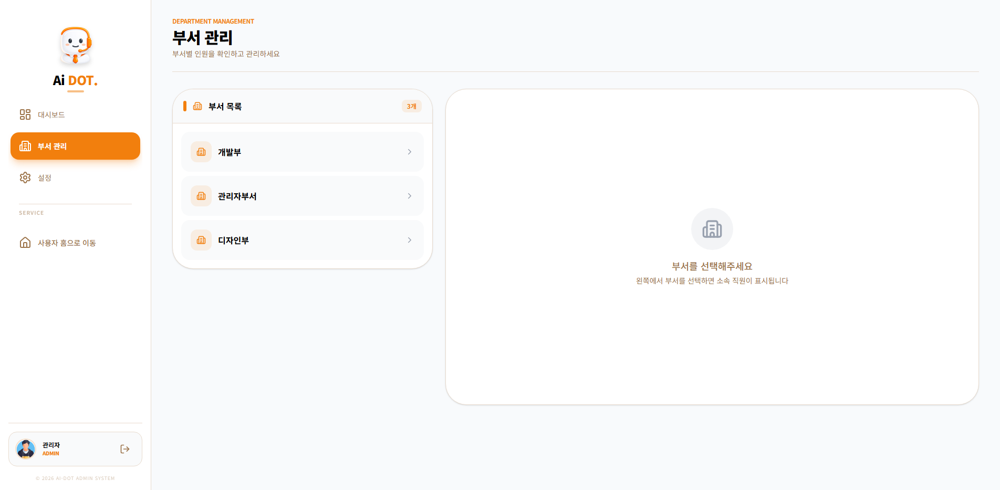

#### 화면 레이아웃

```
┌─────────────────────────────────────────────────────────────────────────┐
│ [Admin Sidebar]                                                          │
├────────────┬────────────────────────────────┬───────────────────────────┤
│            │ 부서 목록                      │ 개발팀 (15명)             │
│ 대시보드   │                                │                           │
│ 사용자관리 │ ┌────────────────────────────┐ │ ┌───────────────────────┐ │
│ 부서관리   │ │ 📁 개발팀          (15명) │ │ │ 홍길동               │ │
│            │ ├────────────────────────────┤ │ │ hong@company.com     │ │
│            │ │ 📁 마케팅팀        (8명)  │ │ │ [부서 이동]          │ │
│            │ ├────────────────────────────┤ │ ├───────────────────────┤ │
│            │ │ 📁 디자인팀        (5명)  │ │ │ 김철수               │ │
│            │ ├────────────────────────────┤ │ │ kim@company.com      │ │
│            │ │ 📁 영업팀          (12명) │ │ │ [부서 이동]          │ │
│            │ ├────────────────────────────┤ │ ├───────────────────────┤ │
│            │ │ 📁 인사팀          (3명)  │ │ │ 이영희               │ │
│            │ └────────────────────────────┘ │ │ lee@company.com      │ │
│            │                                │ │ [부서 이동]          │ │
│            │                                │ └───────────────────────┘ │
│            │                                │                           │
└────────────┴────────────────────────────────┴───────────────────────────┘
```

#### 부서 이동 모달

```
┌─────────────────────────────────────────────────────────────────┐
│ 부서 이동                                                  [X] │
├─────────────────────────────────────────────────────────────────┤
│                                                                 │
│  현재 직원: 홍길동 (hong@company.com)                           │
│  현재 부서: 개발팀                                              │
│                                                                 │
│  이동할 부서 선택                                               │
│  ┌─────────────────────────────────────────────────────────┐   │
│  │ ○ 마케팅팀                                              │   │
│  │ ○ 디자인팀                                              │   │
│  │ ○ 영업팀                                                │   │
│  │ ○ 인사팀                                                │   │
│  └─────────────────────────────────────────────────────────┘   │
│                                                                 │
│                              [취소]  [이동]                     │
└─────────────────────────────────────────────────────────────────┘
```

---

### 3.13 Admin Portal - 인덱스 (ADM-SCR-001)

| 항목 | 내용 |
|------|------|
| 화면 ID | ADM-SCR-001 |
| 화면명 | Admin Portal 인덱스 |
| 경로 | / (Admin Portal) |
| 접근 권한 | Public |
| 관련 요구사항 | APR-001 |
| 관련 유스케이스 | UC-APR-001 |
| 관련 테스트케이스 | TC-APR-IDX-001 ~ TC-APR-IDX-003 |

> **스크린샷**: 

- AIDot 시스템 소개 및 주요 기능 안내
- 다운로드/로그인/라이선스 관리 페이지 네비게이션
- Thymeleaf SSR 기반 렌더링

---

### 3.14 Admin Portal - 설치 파일 다운로드 (ADM-SCR-002)

| 항목 | 내용 |
|------|------|
| 화면 ID | ADM-SCR-002 |
| 화면명 | 설치 파일 다운로드 |
| 경로 | /download (Admin Portal) |
| 접근 권한 | Public |
| 관련 요구사항 | APR-002 |
| 관련 유스케이스 | UC-APR-002 |
| 관련 테스트케이스 | TC-APR-DWN-001 ~ TC-APR-DWN-003 |

> **스크린샷**: 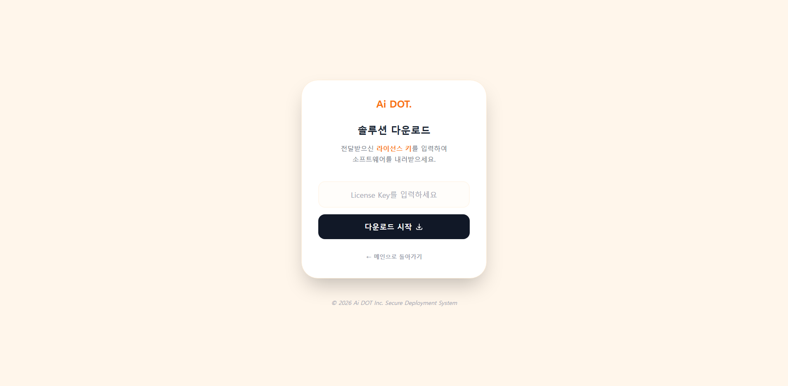

- AIDot 시스템 설치 파일 다운로드
- 버전별 파일 관리

---

### 3.15 Admin Portal - 로그인 (ADM-SCR-003)

| 항목 | 내용 |
|------|------|
| 화면 ID | ADM-SCR-003 |
| 화면명 | Admin Portal 로그인 |
| 경로 | /login (Admin Portal) |
| 접근 권한 | Public |
| 관련 요구사항 | APR-003 |
| 관련 유스케이스 | UC-APR-003 |
| 관련 테스트케이스 | TC-APR-LGN-001 ~ TC-APR-LGN-003 |

> **스크린샷**: 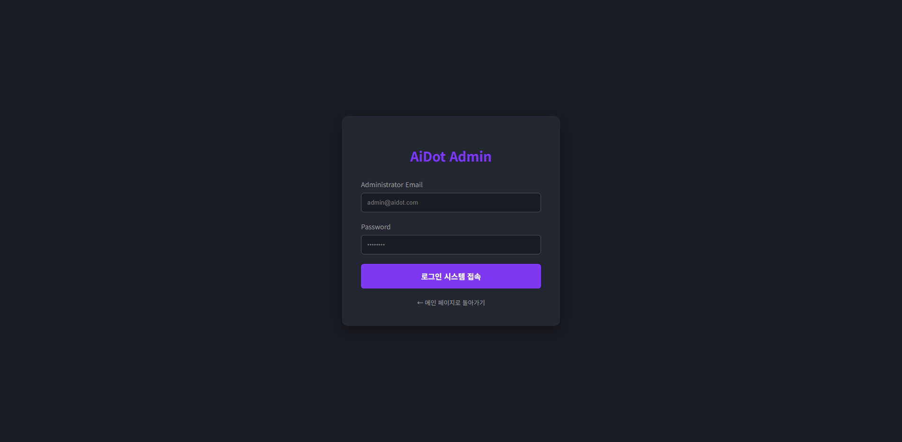

- 이메일/비밀번호 기반 인증
- Spring Security 폼 로그인

---

### 3.16 Admin Portal - 배포 현황 대시보드 (ADM-SCR-004)

| 항목 | 내용 |
|------|------|
| 화면 ID | ADM-SCR-004 |
| 화면명 | 배포 현황 대시보드 |
| 경로 | /dashboard (Admin Portal) |
| 접근 권한 | 인증 필요 |
| 관련 요구사항 | APR-004 |
| 관련 유스케이스 | UC-APR-004 |
| 관련 테스트케이스 | TC-APR-DEP-001 ~ TC-APR-DEP-004 |

> **스크린샷**: 

- 설치 현황 통계 카드
- 활성 라이선스 현황
- 최근 배포/업데이트 이력

---

### 3.17 Admin Portal - 라이선스 관리 (ADM-SCR-005)

| 항목 | 내용 |
|------|------|
| 화면 ID | ADM-SCR-005 |
| 화면명 | 라이선스 관리 |
| 경로 | /license (Admin Portal) |
| 접근 권한 | 인증 필요 |
| 관련 요구사항 | APR-005 |
| 관련 유스케이스 | UC-APR-005 |
| 관련 테스트케이스 | TC-APR-LIC-001 ~ TC-APR-LIC-003 |

> **스크린샷**: 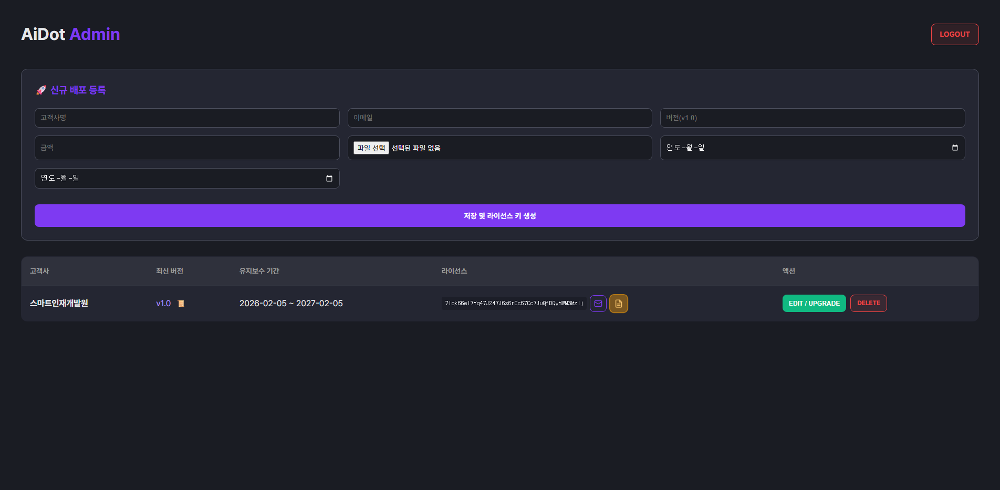

- 라이선스 키 발급
- 유효기간 설정
- 활성/비활성 관리
- 라이선스 목록 조회

---

## 4. UI/UX 가이드라인

### 4.1 색상 팔레트

| 용도 | 색상 | HEX |
|------|------|-----|
| Primary | 오렌지 | #F97316 |
| Primary Hover | 진한 오렌지 | #EA580C |
| Background (Light) | 연한 크림 | #FFF6EB |
| Background (Dark) | 다크 그레이 | #1F2937 |
| Text Main | 검정 | #1F2937 |
| Text Muted | 회색 | #6B7280 |
| Border Light | 연한 회색 | #E5E7EB |
| Border Dark | 진한 회색 | #374151 |
| Success | 초록 | #22C55E |
| Error | 빨강 | #EF4444 |
| Warning | 노랑 | #EAB308 |

### 4.2 타이포그래피

| 요소 | 폰트 | 크기 | 굵기 |
|------|------|------|------|
| 페이지 제목 | Space Grotesk | 2rem (32px) | 900 (Black) |
| 섹션 제목 | Space Grotesk | 1.25rem (20px) | 700 (Bold) |
| 본문 | Space Grotesk | 1rem (16px) | 400 (Regular) |
| 버튼 | Space Grotesk | 1rem (16px) | 700 (Bold) |
| 캡션 | Space Grotesk | 0.75rem (12px) | 500 (Medium) |

### 4.3 간격 (Spacing)

| 용도 | 값 |
|------|-----|
| 페이지 패딩 | 32px (md: 24px, sm: 16px) |
| 카드 패딩 | 24px |
| 카드 간격 | 24px |
| 요소 간격 | 16px |
| 버튼 패딩 | 12px 20px |

### 4.4 모서리 둥글기 (Border Radius)

| 요소 | 값 |
|------|-----|
| 카드 | 2rem (32px) |
| 버튼 | 1.25rem (20px) |
| 입력필드 | 1rem (16px) |
| 뱃지 | 0.5rem (8px) |

### 4.5 그림자 (Shadows)

| 요소 | 값 |
|------|-----|
| 카드 | 0 4px 6px rgba(0,0,0,0.05) |
| 모달 | 0 20px 50px rgba(255,145,0,0.15) |
| Primary 버튼 | 0 10px 20px rgba(249,115,22,0.25) |

### 4.6 반응형 브레이크포인트

| 이름 | 최소 너비 |
|------|----------|
| sm | 640px |
| md | 768px |
| lg | 1024px |
| xl | 1280px |

---

## 5. 모달/팝업 공통 스타일

```
┌─────────────────────────────────────────────────────────────────┐
│ 제목                                                       [X] │  ← 헤더
├─────────────────────────────────────────────────────────────────┤
│                                                                 │
│                           콘텐츠                                │  ← 바디
│                                                                 │
├─────────────────────────────────────────────────────────────────┤
│                              [취소]  [확인]                     │  ← 푸터
└─────────────────────────────────────────────────────────────────┘

- 배경: 반투명 검정 (rgba(0,0,0,0.5)) + backdrop-blur
- 모달: 흰색 배경, border-radius: 2rem
- 최대 너비: 32rem (512px) ~ 48rem (768px)
- 애니메이션: fade-in
```

---

## 문서 이력

| 버전 | 변경일 | 변경자 | 변경 내용 |
|------|--------|--------|----------|
| 1.0 | 2026-01-22 | 박은비 | 최초 작성 |
| 1.2 | 2026-02-03 | 박은비 | 화면 경로, 접근 권한, 홈 최근 항목 수 실제 구현 기반 최신화 |
| 1.3 | 2026-02-07 | 박은비 | AIDot Admin Portal 5개 화면 추가 (ADM-SCR-001~005), 전체 18개 스크린샷 이미지 참조 삽입 |