# Ai DOT 유스케이스 다이어그램

## 문서 정보

| 항목 | 내용 |
|------|------|
| 프로젝트명 | Ai DOT (AI 기반 업무 협업 플랫폼) |
| 문서 버전 | 1.3 |
| 작성일 | 2026-02-07 |

---

## 1. 액터 정의

### 1.1 액터 목록

| 액터 | 설명 |
|------|------|
| **비회원 (Guest)** | 시스템에 로그인하지 않은 사용자. 회원가입과 로그인만 가능 |
| **일반 사용자 (User)** | 시스템에 로그인한 일반 사용자. 모든 사용자 기능 사용 가능 |
| **관리자 (Admin)** | 시스템 관리 권한을 가진 사용자. 사용자 기능 + 관리 기능 사용 가능 |
| **AI 시스템** | 챗봇, 이미지 생성, 음성 변환을 수행하는 AI 서비스 |

### 1.2 액터 계층 구조

```
        ┌─────────┐
        │  Guest  │
        └────┬────┘
             │ extends
        ┌────▼────┐
        │  User   │
        └────┬────┘
             │ extends
        ┌────▼────┐
        │  Admin  │
        └─────────┘
```

---

## 2. 전체 시스템 유스케이스 다이어그램

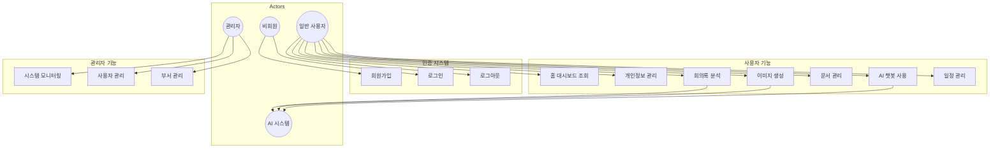

---

## 3. 상세 유스케이스 다이어그램

### 3.1 인증 시스템

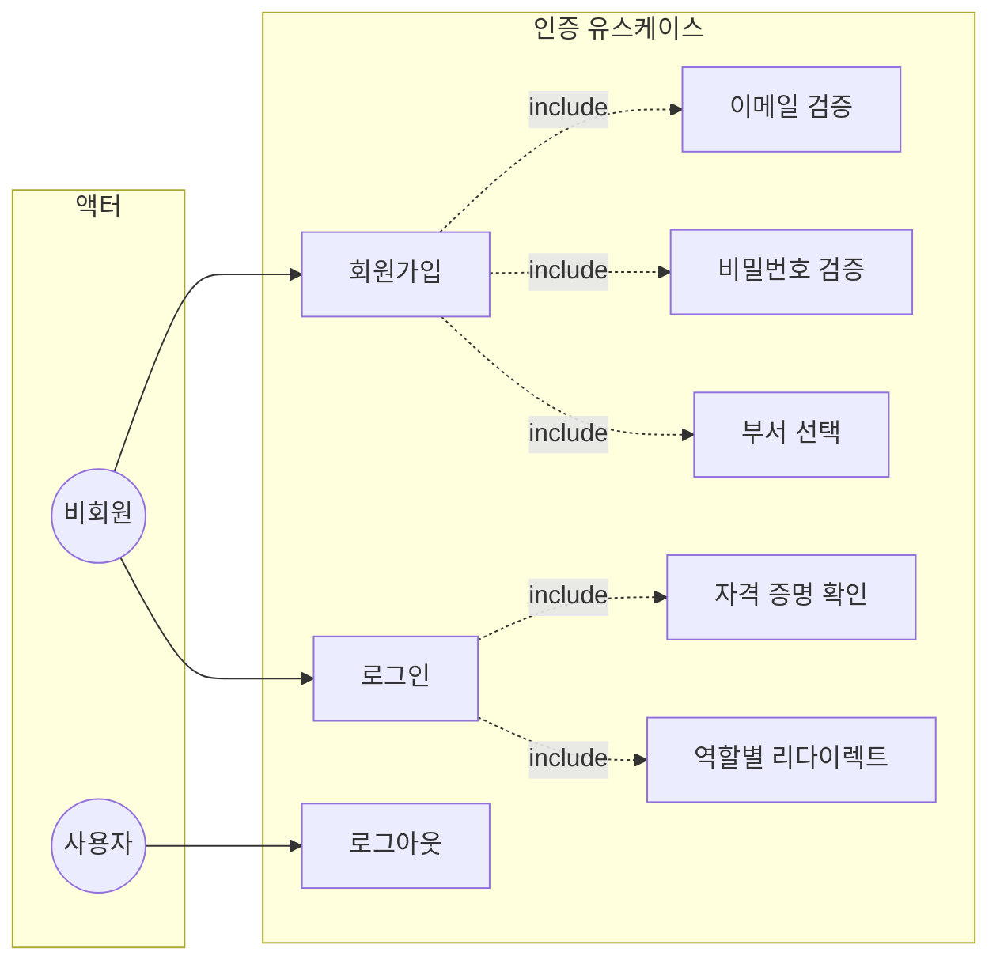

#### 유스케이스 명세: 회원가입 (UC-AUTH-001)

| 항목 | 내용 |
|------|------|
| **유스케이스 ID** | UC-AUTH-001 |
| **유스케이스명** | 회원가입 |
| **액터** | 비회원 (Guest) |
| **관련 화면** | SCR-002 |
| **관련 요구사항** | UR-001 |
| **관련 테스트케이스** | TC-SGN-001 ~ TC-SGN-015 |
| **사전조건** | - 시스템 접속 상태<br>- 로그인되지 않은 상태 |
| **사후조건** | - 신규 계정 생성<br>- 로그인 페이지로 이동 |
| **기본 흐름** | 1. 비회원이 회원가입 페이지에 접근한다<br>2. 시스템이 회원가입 양식을 표시한다<br>3. 비회원이 필수 정보를 입력한다 (이메일, 이름, 비밀번호, 연락처, 성별)<br>4. 비회원이 부서를 선택한다<br>5. 비회원이 "가입 완료하기" 버튼을 클릭한다<br>6. 시스템이 입력값을 검증한다<br>7. 시스템이 계정을 생성하고 성공 메시지를 표시한다<br>8. 시스템이 로그인 페이지로 이동한다 |
| **대안 흐름** | 6a. 이메일 형식이 올바르지 않은 경우<br>&nbsp;&nbsp;&nbsp;→ 실시간 오류 메시지 표시<br>6b. 이메일이 이미 등록된 경우<br>&nbsp;&nbsp;&nbsp;→ "이미 등록된 이메일입니다" 메시지 표시<br>6c. 비밀번호가 4자 미만인 경우<br>&nbsp;&nbsp;&nbsp;→ 오류 메시지 표시 |
| **예외 흐름** | - 서버 오류 시 오류 메시지 표시 |

#### 유스케이스 명세: 로그인 (UC-AUTH-002)

| 항목 | 내용 |
|------|------|
| **유스케이스 ID** | UC-AUTH-002 |
| **유스케이스명** | 로그인 |
| **액터** | 비회원 (Guest) |
| **관련 화면** | SCR-001 |
| **관련 요구사항** | UR-002 |
| **관련 테스트케이스** | TC-LGN-001 ~ TC-LGN-011 |
| **사전조건** | - 등록된 계정 존재<br>- 로그인되지 않은 상태 |
| **사후조건** | - 사용자 인증 완료<br>- 역할에 따른 페이지로 이동 |
| **기본 흐름** | 1. 비회원이 로그인 페이지에 접근한다<br>2. 시스템이 로그인 양식을 표시한다<br>3. 비회원이 이메일과 비밀번호를 입력한다<br>4. 비회원이 "로그인" 버튼을 클릭한다<br>5. 시스템이 자격 증명을 확인한다<br>6. 시스템이 사용자 정보를 저장한다<br>7. 시스템이 역할에 따라 페이지를 이동한다<br>&nbsp;&nbsp;&nbsp;- USER: /home<br>&nbsp;&nbsp;&nbsp;- ADMIN: /dashboard |
| **대안 흐름** | 5a. 이메일이 존재하지 않는 경우<br>&nbsp;&nbsp;&nbsp;→ "이메일 또는 비밀번호가 잘못되었습니다." 메시지 표시<br>5b. 비밀번호가 일치하지 않는 경우<br>&nbsp;&nbsp;&nbsp;→ "이메일 또는 비밀번호가 잘못되었습니다." 메시지 표시 |

---

### 3.2 AI 챗봇 시스템

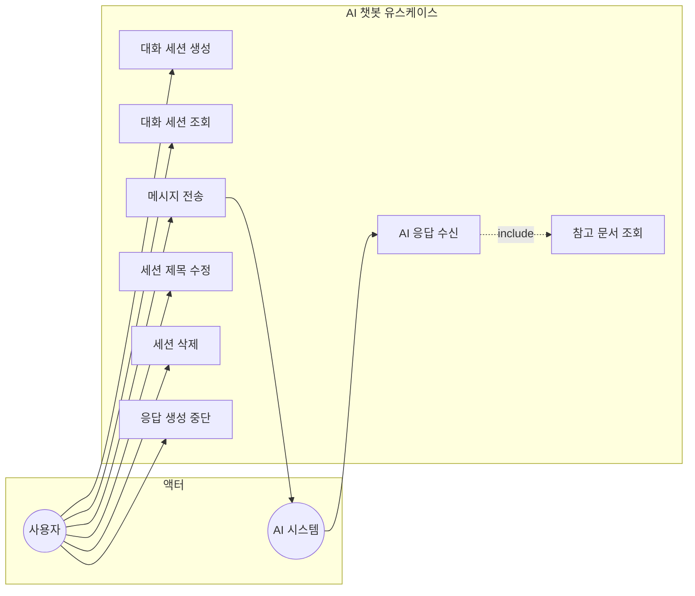

#### 유스케이스 명세: AI 대화 (UC-CHAT-001)

| 항목 | 내용 |
|------|------|
| **유스케이스 ID** | UC-CHAT-001 |
| **유스케이스명** | AI 대화 |
| **액터** | 사용자 (User), AI 시스템 |
| **관련 화면** | SCR-005 |
| **관련 요구사항** | CR-001, CR-002, CR-003 |
| **관련 테스트케이스** | TC-CHT-001 ~ TC-CHT-017 |
| **사전조건** | - 사용자 로그인 상태<br>- 대화 세션 선택 또는 생성 |
| **사후조건** | - 대화 내역 저장<br>- AI 응답 표시 |
| **기본 흐름** | 1. 사용자가 메시지를 입력한다<br>2. 사용자가 전송 버튼을 클릭한다 (또는 Enter)<br>3. 시스템이 사용자 메시지를 화면에 표시한다<br>4. 시스템이 AI 시스템에 메시지를 전달한다<br>5. AI 시스템이 스트리밍 방식으로 응답을 생성한다<br>6. 시스템이 실시간으로 AI 응답을 표시한다<br>7. 응답 완료 시 대화 내역을 저장한다 |
| **대안 흐름** | 4a. 세션이 없는 경우<br>&nbsp;&nbsp;&nbsp;→ 자동으로 새 세션 생성<br>5a. 관련 문서가 있는 경우<br>&nbsp;&nbsp;&nbsp;→ 참고 문서 정보 함께 표시 |
| **예외 흐름** | - 사용자가 중단 버튼 클릭 시 응답 생성 중단<br>- AI 시스템 오류 시 오류 메시지 표시 |

---

### 3.3 이미지 생성 시스템

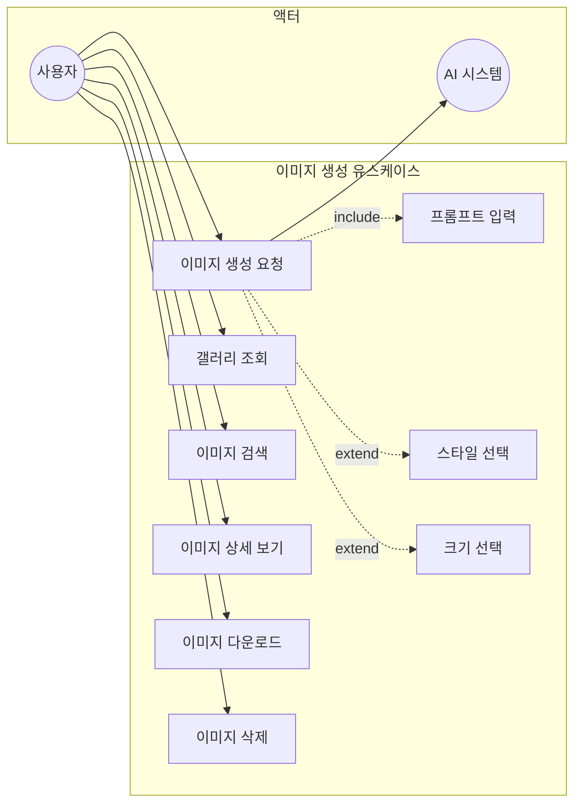

#### 유스케이스 명세: 이미지 생성 (UC-IMG-001)

| 항목 | 내용 |
|------|------|
| **유스케이스 ID** | UC-IMG-001 |
| **유스케이스명** | AI 이미지 생성 |
| **액터** | 사용자 (User), AI 시스템 |
| **관련 화면** | SCR-006 |
| **관련 요구사항** | IR-001, IR-002 |
| **관련 테스트케이스** | TC-IMG-001 ~ TC-IMG-014 |
| **사전조건** | - 사용자 로그인 상태 |
| **사후조건** | - 생성된 이미지 갤러리에 저장 |
| **기본 흐름** | 1. 사용자가 이미지 생성 페이지에 접근한다<br>2. 사용자가 프롬프트를 입력한다 (영어 권장)<br>3. 사용자가 스타일을 선택한다 (선택사항)<br>4. 사용자가 크기를 선택한다 (선택사항)<br>5. 사용자가 "생성하기" 버튼을 클릭한다<br>6. 시스템이 AI 시스템에 생성 요청을 전달한다<br>7. AI 시스템이 이미지를 생성한다<br>8. 시스템이 생성된 이미지를 갤러리에 추가한다<br>9. 시스템이 완료 메시지를 표시한다 |
| **대안 흐름** | 2a. 프롬프트가 비어있는 경우<br>&nbsp;&nbsp;&nbsp;→ "프롬프트를 입력해주세요" 메시지 표시 |
| **비고** | 스타일 옵션: 사실적, 애니메이션, 만화, 스케치, 수채화, 3D 렌더링<br>크기 옵션: 512x512, 768x768, 1024x1024 |

---

### 3.4 문서 관리 시스템

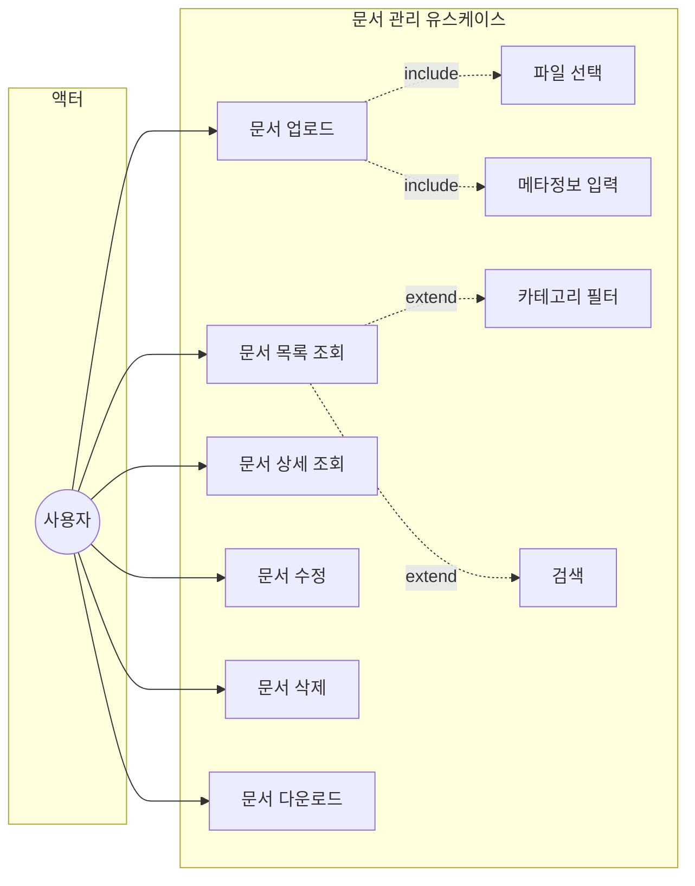

#### 유스케이스 명세: 문서 업로드 (UC-DOC-001)

| 항목 | 내용 |
|------|------|
| **유스케이스 ID** | UC-DOC-001 |
| **유스케이스명** | 문서 업로드 |
| **액터** | 사용자 (User) |
| **관련 화면** | SCR-007 |
| **관련 요구사항** | DR-001 |
| **관련 테스트케이스** | TC-DOC-002 ~ TC-DOC-006, TC-DOC-018 |
| **사전조건** | - 사용자 로그인 상태 |
| **사후조건** | - 문서 저장 완료<br>- 문서 목록에 표시 |
| **기본 흐름** | 1. 사용자가 "파일 업로드" 버튼을 클릭한다<br>2. 시스템이 업로드 모달을 표시한다<br>3. 사용자가 파일을 선택한다<br>4. 시스템이 파일명을 제목 필드에 자동 입력한다<br>5. 사용자가 제목을 확인/수정한다<br>6. 사용자가 카테고리를 선택한다<br>7. 사용자가 요약을 입력한다 (선택사항)<br>8. 사용자가 "업로드" 버튼을 클릭한다<br>9. 시스템이 파일을 저장하고 메타정보를 등록한다<br>10. 시스템이 성공 메시지를 표시한다 |
| **대안 흐름** | 3a. 지원하지 않는 파일 형식인 경우<br>&nbsp;&nbsp;&nbsp;→ 파일 선택 불가<br>8a. 제목이 비어있는 경우<br>&nbsp;&nbsp;&nbsp;→ "제목을 입력해주세요" 메시지 표시 |
| **비고** | 지원 형식: PDF, DOC, DOCX, XLS, XLSX, PPT, PPTX, TXT, HWP<br>제목 최대 255자 |

---

### 3.5 회의록 분석 시스템

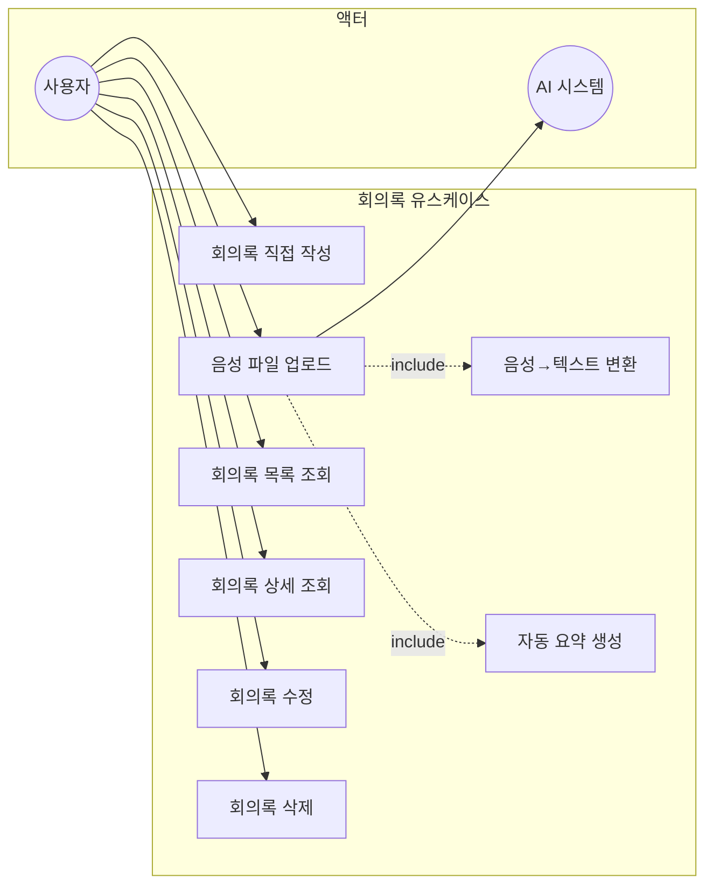

#### 유스케이스 명세: 음성 파일 업로드 (UC-MTG-001)

| 항목 | 내용 |
|------|------|
| **유스케이스 ID** | UC-MTG-001 |
| **유스케이스명** | 회의 녹음 파일 업로드 |
| **액터** | 사용자 (User), AI 시스템 |
| **관련 화면** | SCR-008 |
| **관련 요구사항** | MR-001, MR-002 |
| **관련 테스트케이스** | TC-MTG-001 ~ TC-MTG-006, TC-MTG-012, TC-MTG-015 |
| **사전조건** | - 사용자 로그인 상태<br>- 음성 파일 준비 |
| **사후조건** | - 회의록 생성 (처리 중 상태)<br>- 변환 완료 후 텍스트 및 요약 저장 |
| **기본 흐름** | 1. 사용자가 "파일 업로드" 버튼을 클릭한다<br>2. 시스템이 업로드 모달을 표시한다<br>3. 사용자가 회의 제목을 입력한다<br>4. 사용자가 참석자를 입력한다 (선택사항)<br>5. 사용자가 음성 파일을 선택한다<br>6. 사용자가 "업로드" 버튼을 클릭한다<br>7. 시스템이 파일을 저장하고 처리 대기열에 추가한다<br>8. AI 시스템이 음성을 텍스트로 변환한다 (STT)<br>9. AI 시스템이 텍스트를 요약한다<br>10. 시스템이 처리 결과를 저장한다 |
| **대안 흐름** | 8a. 음성 변환 실패 시<br>&nbsp;&nbsp;&nbsp;→ 상태를 "ERROR"로 변경 |
| **비고** | 지원 형식: MP3, WAV, M4A, OGG, WebM, MP4<br>처리 상태: QUEUED → PROCESSING → COMPLETED/ERROR |

---

### 3.6 일정 관리 시스템

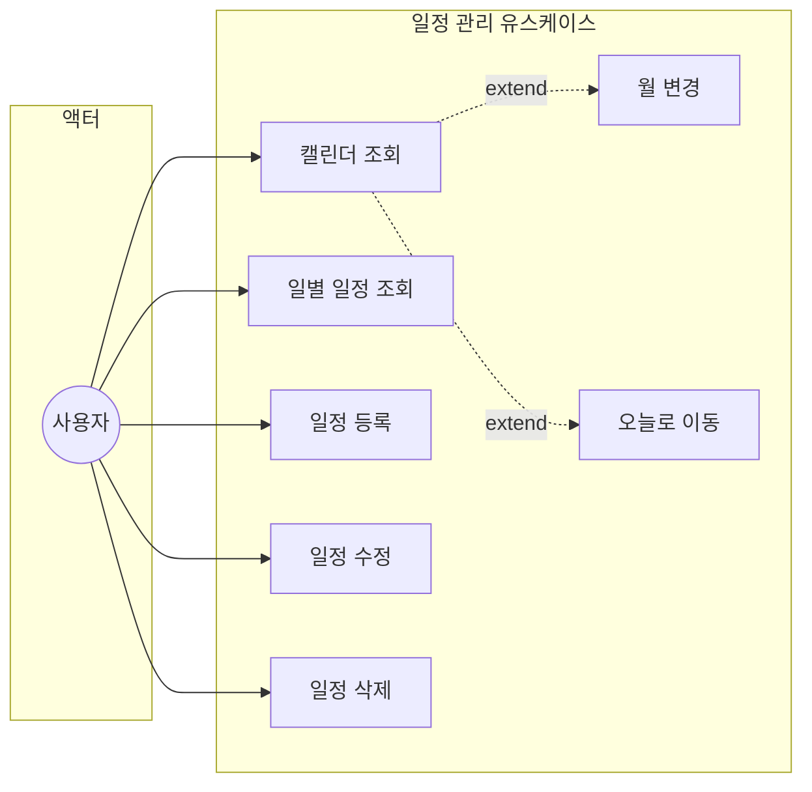

#### 유스케이스 명세: 일정 등록 (UC-SCH-001)

| 항목 | 내용 |
|------|------|
| **유스케이스 ID** | UC-SCH-001 |
| **유스케이스명** | 일정 등록 |
| **액터** | 사용자 (User) |
| **관련 화면** | SCR-009 |
| **관련 요구사항** | SR-001, SR-002, SR-003 |
| **관련 테스트케이스** | TC-SCH-001 ~ TC-SCH-015 |
| **사전조건** | - 사용자 로그인 상태<br>- 날짜 선택 상태 |
| **사후조건** | - 일정 저장<br>- 캘린더에 표시 |
| **기본 흐름** | 1. 사용자가 캘린더에서 날짜를 선택한다<br>2. 사용자가 "일정 추가" 버튼을 클릭한다<br>3. 시스템이 일정 등록 모달을 표시한다<br>4. 사용자가 일정 제목을 입력한다<br>5. 사용자가 시작/종료 시간을 선택한다<br>6. 사용자가 카테고리를 선택한다<br>7. 사용자가 상세 내용을 입력한다 (선택사항)<br>8. 사용자가 "등록" 버튼을 클릭한다<br>9. 시스템이 일정을 저장한다<br>10. 시스템이 캘린더를 갱신한다 |
| **대안 흐름** | 4a. 제목이 비어있는 경우<br>&nbsp;&nbsp;&nbsp;→ "일정 제목을 입력해주세요" 메시지 표시<br>5a. 종료 시간이 시작 시간보다 빠른 경우<br>&nbsp;&nbsp;&nbsp;→ "종료 시간은 시작 시간 이후여야 합니다" 메시지 표시 |
| **비고** | 제목 최대 100자<br>카테고리: 일반, 업무, 회의, 개인, 중요 |

---

### 3.7 관리자 시스템

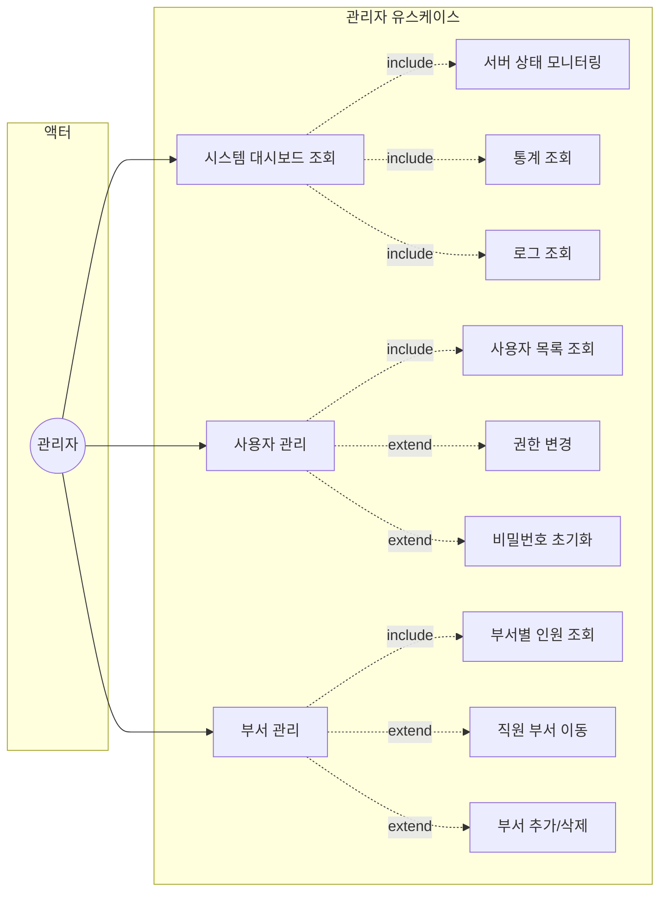

#### 유스케이스 명세: 시스템 모니터링 (UC-ADM-001)

| 항목 | 내용 |
|------|------|
| **유스케이스 ID** | UC-ADM-001 |
| **유스케이스명** | 시스템 대시보드 |
| **액터** | 관리자 (Admin) |
| **관련 화면** | SCR-010 |
| **관련 요구사항** | AR-001 |
| **관련 테스트케이스** | TC-DSH-001 ~ TC-DSH-011 |
| **사전조건** | - 관리자 권한으로 로그인 |
| **사후조건** | - 시스템 현황 표시 |
| **기본 흐름** | 1. 관리자가 대시보드 페이지에 접근한다<br>2. 시스템이 서버 리소스 현황을 표시한다 (CPU, 메모리, 디스크)<br>3. 시스템이 실행 중인 프로세스 목록을 표시한다<br>4. 시스템이 통계 카드를 표시한다<br>5. 시스템이 차트를 표시한다<br>&nbsp;&nbsp;&nbsp;- 일별 활동 추이<br>&nbsp;&nbsp;&nbsp;- AI 기능 사용 현황<br>&nbsp;&nbsp;&nbsp;- 부서별 인원/활동<br>6. 시스템이 실시간 로그를 표시한다 |

#### 유스케이스 명세: 사용자 권한 변경 (UC-ADM-002)

| 항목 | 내용 |
|------|------|
| **유스케이스 ID** | UC-ADM-002 |
| **유스케이스명** | 사용자 권한 변경 |
| **액터** | 관리자 (Admin) |
| **관련 화면** | SCR-011 |
| **관련 요구사항** | AR-002 |
| **관련 테스트케이스** | TC-ADU-001 ~ TC-ADU-008 |
| **사전조건** | - 관리자 권한으로 로그인<br>- 대상 사용자 선택 |
| **사후조건** | - 사용자 권한 변경 |
| **기본 흐름** | 1. 관리자가 사용자 관리 페이지에 접근한다<br>2. 관리자가 사용자 목록에서 대상을 선택한다<br>3. 시스템이 사용자 상세 정보를 표시한다<br>4. 관리자가 새 역할을 선택한다 (USER/ADMIN)<br>5. 관리자가 저장 버튼을 클릭한다<br>6. 시스템이 권한을 변경하고 결과를 표시한다 |

---

### 3.8 AIDot Admin Portal

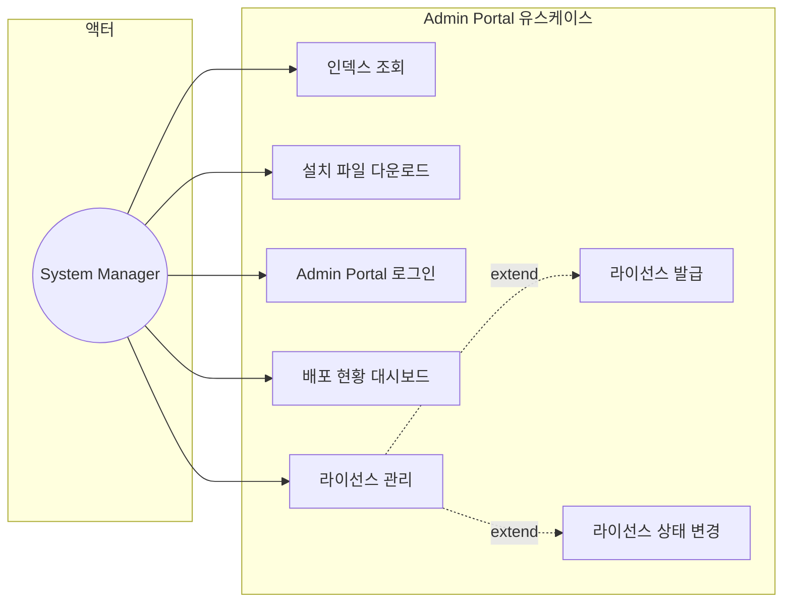

#### 유스케이스 명세: Admin Portal 인덱스 (UC-APR-001)

| 항목 | 내용 |
|------|------|
| **유스케이스 ID** | UC-APR-001 |
| **유스케이스명** | Admin Portal 인덱스 조회 |
| **액터** | System Manager |
| **관련 화면** | ADM-SCR-001 |
| **관련 요구사항** | APR-001 |
| **관련 테스트케이스** | TC-APR-IDX-001 ~ TC-APR-IDX-003 |
| **사전조건** | - Admin Portal 서비스 가동 중 |
| **사후조건** | - 시스템 개요 정보 표시 |
| **기본 흐름** | 1. System Manager가 Admin Portal URL에 접근한다<br>2. 시스템이 메인 인덱스 페이지를 표시한다<br>3. 시스템 소개 및 주요 기능을 확인한다<br>4. 다운로드/로그인/라이선스 링크를 통해 이동한다 |

#### 유스케이스 명세: 설치 파일 다운로드 (UC-APR-002)

| 항목 | 내용 |
|------|------|
| **유스케이스 ID** | UC-APR-002 |
| **유스케이스명** | 설치 파일 다운로드 |
| **액터** | System Manager |
| **관련 화면** | ADM-SCR-002 |
| **관련 요구사항** | APR-002 |
| **관련 테스트케이스** | TC-APR-DWN-001 ~ TC-APR-DWN-003 |
| **사전조건** | - Admin Portal 접근 가능 |
| **사후조건** | - 설치 파일 다운로드 완료<br>- 다운로드 이력 기록 |
| **기본 흐름** | 1. System Manager가 다운로드 페이지에 접근한다<br>2. 사용 가능한 설치 파일 목록을 확인한다<br>3. 원하는 파일을 다운로드한다<br>4. 시스템이 다운로드 이력을 기록한다 |

#### 유스케이스 명세: Admin Portal 로그인 (UC-APR-003)

| 항목 | 내용 |
|------|------|
| **유스케이스 ID** | UC-APR-003 |
| **유스케이스명** | Admin Portal 로그인 |
| **액터** | System Manager |
| **관련 화면** | ADM-SCR-003 |
| **관련 요구사항** | APR-003 |
| **관련 테스트케이스** | TC-APR-LGN-001 ~ TC-APR-LGN-003 |
| **사전조건** | - 등록된 관리자 계정 존재 |
| **사후조건** | - 인증 세션 생성<br>- 대시보드 이동 |
| **기본 흐름** | 1. System Manager가 로그인 페이지에 접근한다<br>2. 이메일과 비밀번호를 입력한다<br>3. 로그인 버튼을 클릭한다<br>4. Spring Security가 인증을 수행한다<br>5. 성공 시 배포 현황 대시보드로 이동한다 |
| **대안 흐름** | 4a. 인증 실패 시<br>&nbsp;&nbsp;&nbsp;→ 오류 메시지 표시, 로그인 페이지 유지 |

#### 유스케이스 명세: 배포 현황 대시보드 (UC-APR-004)

| 항목 | 내용 |
|------|------|
| **유스케이스 ID** | UC-APR-004 |
| **유스케이스명** | 배포 현황 대시보드 조회 |
| **액터** | System Manager |
| **관련 화면** | ADM-SCR-004 |
| **관련 요구사항** | APR-004 |
| **관련 테스트케이스** | TC-APR-DEP-001 ~ TC-APR-DEP-004 |
| **사전조건** | - Admin Portal 로그인 상태 |
| **사후조건** | - 배포 현황 정보 표시 |
| **기본 흐름** | 1. System Manager가 대시보드 페이지에 접근한다<br>2. 설치 현황 통계 카드를 확인한다<br>3. 활성 라이선스 현황을 확인한다<br>4. 최근 배포/업데이트 이력을 확인한다 |

#### 유스케이스 명세: 라이선스 관리 (UC-APR-005)

| 항목 | 내용 |
|------|------|
| **유스케이스 ID** | UC-APR-005 |
| **유스케이스명** | 라이선스 관리 |
| **액터** | System Manager |
| **관련 화면** | ADM-SCR-005 |
| **관련 요구사항** | APR-005 |
| **관련 테스트케이스** | TC-APR-LIC-001 ~ TC-APR-LIC-003 |
| **사전조건** | - Admin Portal 로그인 상태 |
| **사후조건** | - 라이선스 변경사항 반영 |
| **기본 흐름** | 1. System Manager가 라이선스 관리 페이지에 접근한다<br>2. 발급된 라이선스 목록을 확인한다<br>3. 새 라이선스를 발급한다 (키 생성, 유효기간 설정)<br>4. 기존 라이선스의 상태를 변경한다 (활성/비활성) |

---

### 5.4 Admin Portal 로그인 시퀀스

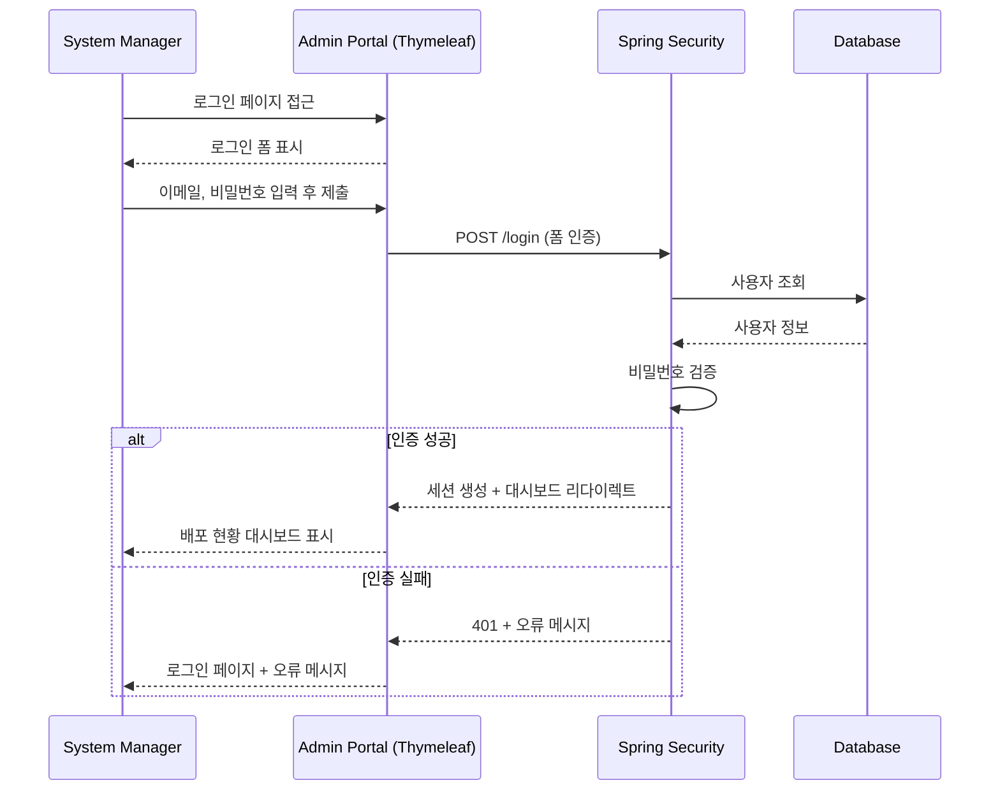

---

## 4. 유스케이스 매트릭스

### 4.1 액터별 유스케이스 매핑

| 유스케이스 | Guest | User | Admin |
|-----------|:-----:|:----:|:-----:|
| 회원가입 | O | - | - |
| 로그인 | O | - | - |
| 로그아웃 | - | O | O |
| 홈 대시보드 | - | O | O |
| 개인정보 관리 | - | O | O |
| AI 챗봇 | - | O | O |
| 이미지 생성 | - | O | O |
| 문서 관리 | - | O | O |
| 회의록 분석 | - | O | O |
| 일정 관리 | - | O | O |
| 시스템 대시보드 | - | - | O |
| 사용자 관리 | - | - | O |
| 부서 관리 | - | - | O |

### 4.2 유스케이스-요구사항-화면-테스트케이스 추적표

| 유스케이스 ID | 유스케이스명 | 관련 요구사항 | 관련 화면 | 관련 테스트케이스 |
|--------------|-------------|--------------|----------|------------------|
| UC-AUTH-001 | 회원가입 | UR-001 | SCR-002 | TC-SGN-* |
| UC-AUTH-002 | 로그인 | UR-002 | SCR-001 | TC-LGN-* |
| UC-AUTH-003 | 로그아웃 | UR-003 | 공통 (사이드바) | TC-NAV-004 |
| UC-USER-001 | 개인정보 관리 | UR-004, UR-005 | SCR-003, SCR-004 | TC-HOM-*, TC-MYP-* |
| UC-CHAT-001 | AI 대화 | CR-001, CR-002, CR-003 | SCR-005 | TC-CHT-* |
| UC-IMG-001 | 이미지 생성 | IR-001, IR-002 | SCR-006 | TC-IMG-* |
| UC-DOC-001 | 문서 업로드 | DR-001 | SCR-007 | TC-DOC-002 ~ TC-DOC-006 |
| UC-DOC-002 | 문서 관리 | DR-002, DR-003 | SCR-007 | TC-DOC-001, TC-DOC-007 ~ TC-DOC-018 |
| UC-MTG-001 | 회의록 업로드 | MR-001, MR-002 | SCR-008 | TC-MTG-001 ~ TC-MTG-006 |
| UC-MTG-002 | 회의록 관리 | MR-003 | SCR-008 | TC-MTG-007 ~ TC-MTG-015 |
| UC-SCH-001 | 일정 관리 | SR-001, SR-002, SR-003 | SCR-009 | TC-SCH-* |
| UC-ADM-001 | 시스템 모니터링 | AR-001 | SCR-010 | TC-DSH-* |
| UC-ADM-002 | 사용자 관리 | AR-002 | SCR-011 | TC-ADU-* |
| UC-ADM-003 | 부서 관리 | AR-003 | SCR-012 | TC-DPT-*, TC-DPM-* |
| UC-APR-001 | Admin Portal 인덱스 | APR-001 | ADM-SCR-001 | TC-APR-IDX-* |
| UC-APR-002 | 설치 파일 다운로드 | APR-002 | ADM-SCR-002 | TC-APR-DWN-* |
| UC-APR-003 | Admin Portal 로그인 | APR-003 | ADM-SCR-003 | TC-APR-LGN-* |
| UC-APR-004 | 배포 현황 대시보드 | APR-004 | ADM-SCR-004 | TC-APR-DEP-* |
| UC-APR-005 | 라이선스 관리 | APR-005 | ADM-SCR-005 | TC-APR-LIC-* |

---

## 5. 시퀀스 다이어그램

### 5.1 로그인 시퀀스

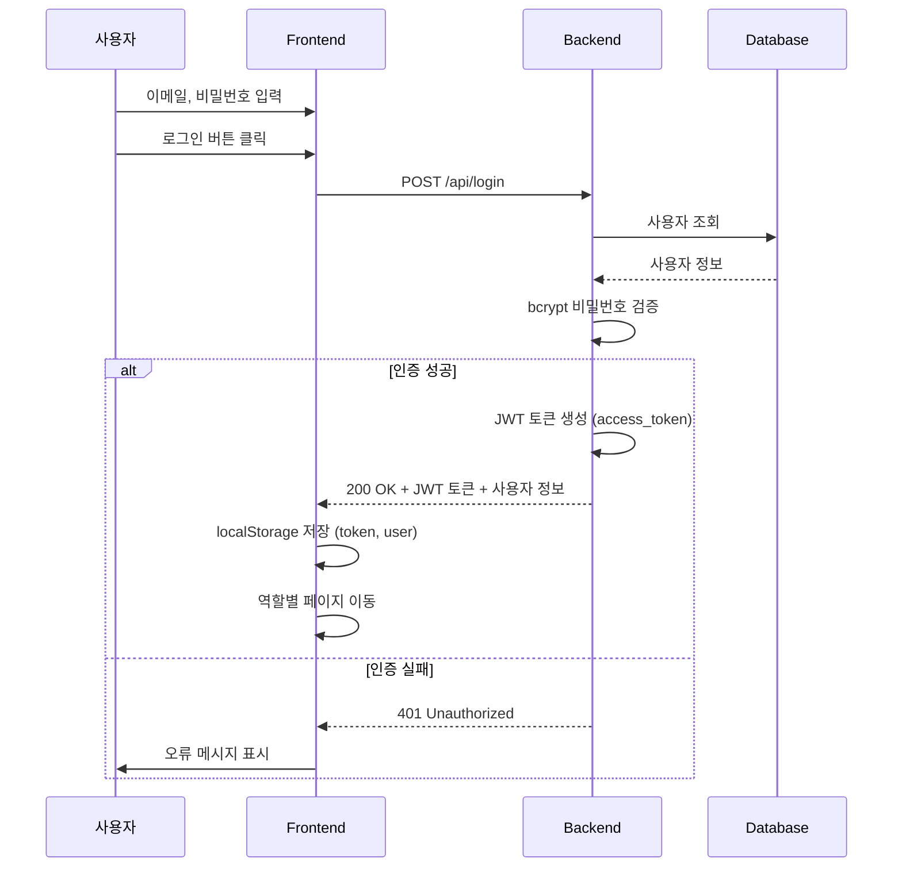

### 5.2 AI 대화 시퀀스

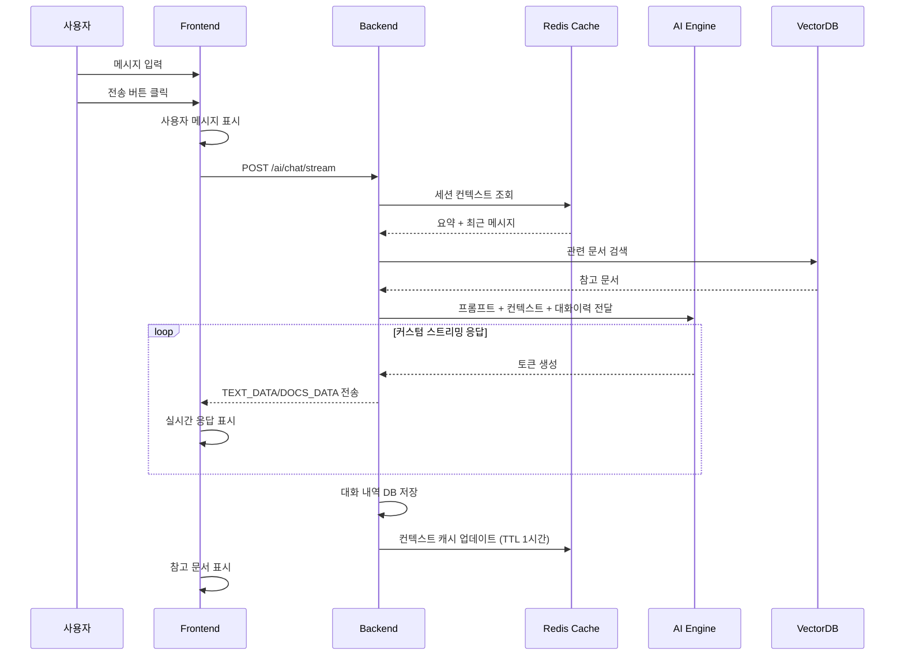

### 5.3 이미지 생성 시퀀스

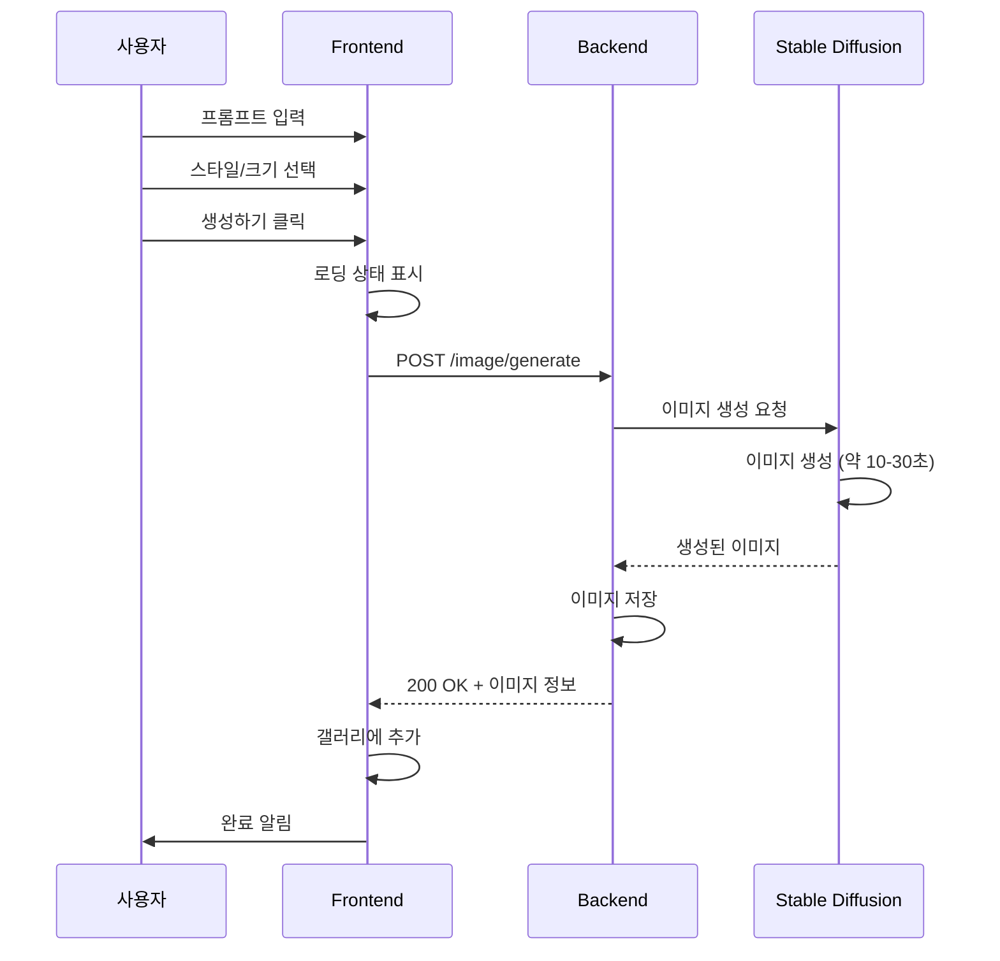

---

## 문서 이력

| 버전 | 변경일 | 변경자 | 변경 내용 |
|------|--------|--------|----------|
| 1.0 | 2026-01-22 | 박제연 | 최초 작성 |
| 1.1 | 2026-01-23 | 박제연 | 시퀀스 다이어그램 업데이트 (JWT 인증, Redis 캐싱) |
| 1.2 | 2026-02-03 | 박제연 | 스트리밍 방식, 에러 메시지, 접근 권한 실제 구현 기반 최신화 |
| 1.3 | 2026-02-07 | 박제연 | AIDot Admin Portal 유스케이스 상세 (UC-APR-001~005) + 시퀀스 다이어그램 추가 |
